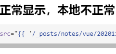

* content
{:toc}

## 测试博客本地与远端显示

``` html
dsfgdfg
% highlight html %
fsdsd
% endhighlight %
```

>sfsdfsfsdfs
>sfsdfsadfsafd

sfdsdfsdfvvv

## 图片的几种显示方式

### 远程正常显示，本地不正常

```html

```


微信
----------------


微信
----------------


### 远程本地都正常


