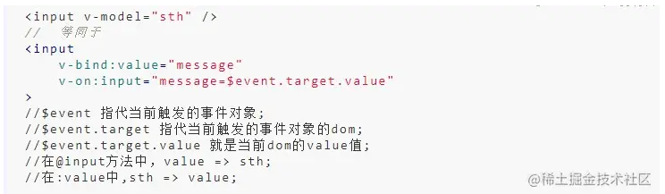
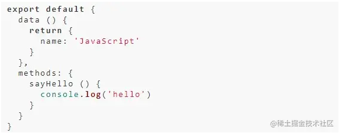
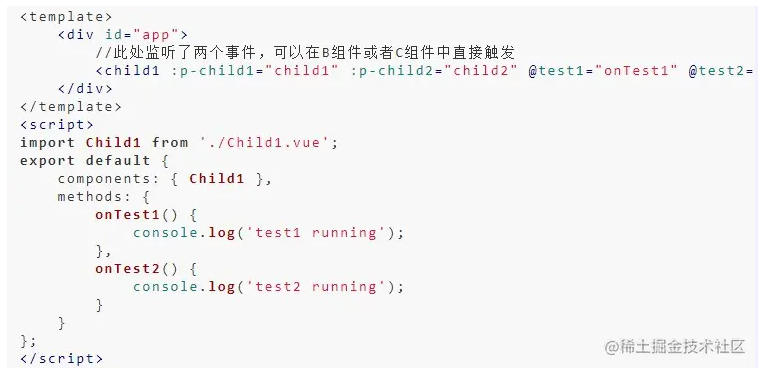
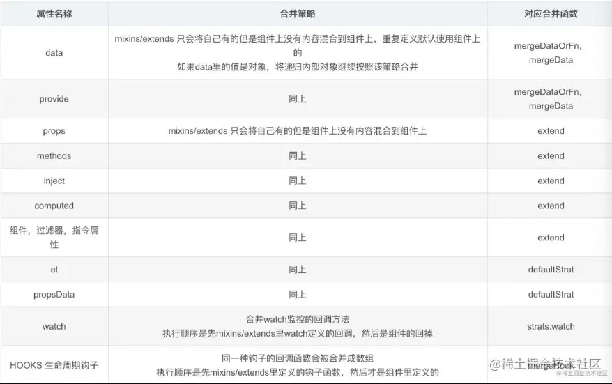

# 框架::1.vue2面试题

## 1. Vue的基本原理

当一个Vue实例创建时，Vue会遍历data中的属性，用 **Object.defineProperty**（vue3.0使用proxy ）将它们转为 getter/setter，并且在内部追踪相关依赖，在属性被访问和修改时通知变化。 每个组件实例都有相应的 **watcher 程序实例**，它会在组件渲染的过程中把属性记录为依赖，之后当依赖项的setter被调用时，会通知watcher重新计算，从而致使它关联的组件得以更新。


### 1.2 Vue的优点

* 轻量级框架：只关注视图层，是一个构建数据的视图集合，大小只有几十 `kb` ；
* 简单易学：国人开发，中文文档，不存在语言障碍 ，易于理解和学习；
* 双向数据绑定：保留了 `angular` 的特点，在数据操作方面更为简单；
* 组件化：保留了 `react` 的优点，实现了 `html` 的封装和重用，在构建单页面应用方面有着独特的优势；
* 视图，数据，结构分离：使数据的更改更为简单，不需要进行逻辑代码的修改，只需要操作数据就能完成相关操作；
* 虚拟DOM：`dom` 操作是非常耗费性能的，不再使用原生的 `dom` 操作节点，极大解放 `dom` 操作，但具体操作的还是 `dom` 不过是换了另一种方式；
* 运行速度更快：相比较于 `react` 而言，同样是操作虚拟 `dom`，就性能而言， `vue` 存在很大的优势。

## 2. Vue响应式的原理

### **2.1 什么是数据劫持**

数据劫持比较好理解，通常我们利用`Object.defineProperty`劫持对象的访问器，在属性值发生变化时我们可以获取变化，从而进行进一步操作。

### **2.2 发布者模式 / 订阅者模式**

在软件架构中，**发布订阅**是一种消息范式，消息的发送者（称为发布者）不会将消息直接发送给特定的接收者（称为订阅者）。而是将发布的消息分为不同的类别，无需了解哪些订阅者（如果有的话）可能存在。同样的，订阅者可以表达对一个或多个类别的兴趣，只接收感兴趣的消息，无需了解哪些发布者（如果有的话）存在。

这里很明显了，区别就在于，不同于观察者和被观察者，**发布者和订阅者是互相不知道对方的存在的，发布者只需要把消息发送到订阅器里面，订阅者只管接受自己需要订阅的内容**

### **2.3 响应式原理**

Vue响应式的原理就是采用**数据劫持**结合**发布者-订阅者模式**的方式，通过**Object.defineProperty()** 来劫持各个属性的setter，getter，在数据变动时发布消息给订阅者，触发相应的监听回调。主要分为以下几个步骤：

**Observe**(被劫持的数据对象) **Compile**(vue的编译器) **Wather**(订阅者) **Dep**(用于收集Watcher订阅者们)

1.需要给**Observe**的数据对象进行递归遍历，包括子属性对象的属性，都加上**setter**和**getter**这样的属性，给这个对象的某个值赋值，就会触发**setter**，那么就能监听到了数据变化。

2.**Compile**解析模板指令，将模板中的变量替换成数据，然后初始化渲染页面视图，并将每个指令对应的节点绑定更新函数，添加监听数据的订阅者，一旦数据有变动，收到通知，更新视图

3.**Watcher**订阅者是**Observer**和**Compile**之间通信的桥梁，主要做的事情是: ①在自身实例化时往属性订阅器(**Dep**)里面添加自己 ②自身必须有一个**update**()方法 ③待属性变动**dep.notice()** 通知时，能调用自身的**update()** 方法，并触发**Compile**中绑定的回调，则功成身退。

4.MVVM作为数据绑定的入口，整合**Observer**、**Compile**和**Watcher**三者，通过**Observer**来监听自己的**model**数据变化，通过**Compile**来解析编译模板指令，最终利用**Watcher**搭起**Observer**和**Compile**之间的通信桥梁，达到数据变化 -\> 视图更新；视图交互变化(input) -> 数据model变更的双向绑定效果。


## 3. Object.defineProperty的使用方式，有什么缺点

**使用方法**

**Object.defineProperty( obj, prop, descriptor )**

三个参数:

**obj** 要定义的对象

**prop** 要定义或修改的属性名称或 Symbol

**descriptor** 要定义或修改的属性描述符(配置对象)

属性描述符(配置对象)

**get** 属性的 getter 函数，如果没有 getter，则为 `undefined`。当访问该属性时，会调用此函数。执行时不传入任何参数，但是会传入 `this` 对象（由于继承关系，这里的`this`并不一定是定义该属性的对象）。该函数的返回值会被用作属性的值。 **默认为 \[`undefined`\]** **set** 属性的 setter 函数，如果没有 setter，则为 `undefined`。当属性值被修改时，会调用此函数。该方法接受一个参数（也就是被赋予的新值），会传入赋值时的 `this` 对象。 **默认为 \[`undefined`\]**

**缺点：**

在对一些属性进行操作时，使用这种方法无法拦截，比如**通过下标方式修改数组**数据或者**给对象新增属性**，这都不能触发组件的重新渲染，因为 Object.defineProperty 不能拦截到这些操作。更精确的来说，对于数组而言，大部分操作都是拦截不到的，只是 Vue 内部通过重写函数的方式解决了这个问题。

在 Vue3.0 中已经不使用这种方式了，而是通过使用 Proxy 对对象进行代理，从而实现数据劫持。使用Proxy 的好处是它可以完美的监听到任何方式的数据改变，唯一的缺点是兼容性的问题，因为 Proxy 是 ES6 的语法。

### 3.2 Object.defineProperty(target, key, options)，options可传什么参数？

* value：给target\[key\]设置初始值
* get：调用target\[key\]时触发
* set：设置target\[key\]时触发
* writable：规定target\[key\]是否可被重写，默认false
* enumerable：规定了key是否会出现在target的枚举属性中，默认为false
* configurable：规定了能否改变options，以及删除key属性，默认false，具体详细请看

## 4. MVVM、MVC、MVP的区别

### **（1）MVC**

**M: model数据模型, V:view视图模型, C: controller控制器**

MVC 通过分离 Model、View 和 Controller 的方式来组织代码结构。其中 View 负责页面的显示逻辑，Model 负责存储页面的业务数据，以及对相应数据的操作。并且 View 和 Model 应用了**观察者模式**，当 Model 层发生改变的时候它会**通知**有关 View 层更新页面。Controller 层是 View 层和 Model 层的**纽带**，它主要负责用户与应用的响应操作，当用户与页面产生交互的时候，Controller 中的事件触发器就开始工作了，通过调用 Model 层，来完成对 Model 的修改，然后 Model 层再去通知View视图更新。


### **（2）MVP**

**M: model数据模型, V:view视图模型, P: Presenter 控制器**

MVP 模式与 MVC 唯一不同的在于 Presenter 和 Controller。在 MVC 模式中使用观察者模式，来实现当 Model 层数据发生变化的时候，通知 View 层的更新。这样 View 层和 Model 层耦合在一起，当项目逻辑变得复杂的时候，可能会造成代码的混乱，并且可能会对代码的复用性造成一些问题。

MVP 的模式通过使用 Presenter 来实现对 View 层和 Model 层的**解耦**。MVC 中的Controller 只知道 Model 的接口，因此它没有办法控制 View 层的更新，MVP 模式中，View 层的接口暴露给了 Presenter 因此可以在 Presenter 中将 Model 的变化和 View 的变化**绑定**在一起，以此来实现 View 和 Model 的**同步更新**。这样就实现了对 View 和 Model 的解耦，Presenter 还包含了其他的响应逻辑。

### **（3）MVVM**

MVVM 分为 Model、View、ViewModel：

* **Model代表数据模型，数据和业务逻辑都在Model层中定义；**
* **View代表UI视图，负责数据的展示；**
* **ViewModel负责监听Model中数据的改变并且控制视图的更新，处理用户交互操作；**

Model和View并无直接关联，而是通过ViewModel来进行联系的，Model和ViewModel之间有着**双向数据绑定**的联系。因此当Model中的数据改变时会触发View层的刷新，View中由于用户交互操作而改变的数据也会在Model中同步。

这种模式实现了 Model和View的**数据自动同步**，因此开发者只需要专注于数据的维护操作即可，而不需要自己操作DOM。


### 4.2 **MVVM**的优缺点?

优点:

* 分离视图（View）和模型（Model），降低代码耦合，提⾼视图或者逻辑的重⽤性: ⽐如视图（View）可以独⽴于Model变化和修改，⼀个ViewModel可以绑定不同的"View"上，当View变化的时候Model不可以不变，当Model变化的时候View也可以不变。你可以把⼀些视图逻辑放在⼀个ViewModel⾥⾯，让很多view重⽤这段视图逻辑
* 提⾼可测试性: ViewModel的存在可以帮助开发者更好地编写测试代码
* ⾃动更新dom: 利⽤双向绑定,数据更新后视图⾃动更新,让开发者从繁琐的⼿动dom中解放

缺点:

* Bug很难被调试: 因为使⽤双向绑定的模式，当你看到界⾯异常了，有可能是你View的代码有Bug，也可能是Model的代码有问题。数据绑定使得⼀个位置的Bug被快速传递到别的位置，要定位原始出问题的地⽅就变得不那么容易了。另外，数据绑定的声明是指令式地写在View的模版当中的，这些内容是没办法去打断点debug的
* ⼀个⼤的模块中model也会很⼤，虽然使⽤⽅便了也很容易保证了数据的⼀致性，当时⻓期持有，不释放内存就造成了花费更多的内存
* 对于⼤型的图形应⽤程序，视图状态较多，ViewModel的构建和维护的成本都会⽐较⾼

## 5. Vue的常用指令及作用

* v-on 给标签绑定函数，可以缩写为@，例如绑定一个点击函数 函数必须写在methods里面
* v-bind 动态绑定 作用： 及时对页面的数据进行更改, 可以简写成：冒号
* v-slot: 缩写为#, 组件插槽
* v-for 根据数组的个数, 循环数组元素的同时还生成所在的标签
* v-show 显示内容
* v-if 显示与隐藏
* v-else 必须和v-if连用 不能单独使用 否则报错
* v-text 解析文本
* v-html 解析html标签

### 5.2 Vue怎么动态绑定Class 与 Style

`v-bind:class="{{ '类名': bool, '类名': bool ......}}"`

    v-bind:class="{ '类名': bool, '类名': bool ......}"
    如果值为true 该类样式就会被应用在元素身上, false则不会
    注意点：如果类名有 - ，则需要使用引号包起来
    复制代码

`v-bind:style` 的对象语法十分直观——看着非常像 CSS，但其实是一个 JavaScript 对象。CSS property 名可以用驼峰式 (camelCase) 或短横线分隔 (kebab-case，记得用引号括起来) 来命名

直接绑定到一个样式对象通常更好，这会让模板更清晰：

    <div v-bind:style="styleObject"></div>
    data: {
      styleObject: {
        color: 'red',
        fontSize: '13px'
      }
    }
    复制代码

## 6. vue常用的修饰符

**v-on**

* `.stop` \- 调用 `event.stopPropagation()`。 阻止默认事件
* `.prevent` \- 调用 `event.preventDefault()`。阻止默认行为
* `.native` \- 监听组件根元素的原生事件。

**v-bind**

* `.prop` \- 作为一个 DOM property 绑定而不是作为 attribute 绑定。
* `.camel` \- (2.1.0+) 将 kebab-case attribute 名转换为 camelCase。(从 2.1.0 开始支持)
* `.sync` (2.3.0+) 语法糖，会扩展成一个更新父组件绑定值的 `v-on` 侦听器。

**v-model**

* \[`.lazy`\]\- 取代 `input` 监听 `change` 事件
* \[`.number`\] \- 输入字符串转为有效的数字
* \[`.trim`\] \- 输入首尾空格过滤

## 7. Vue的内置组件

### **component**

渲染一个“元组件”为动态组件。依 is 的值，来决定哪个组件被渲染

在一个多标签的界面中使用 is attribute 来切换不同的组件：tap栏切换

### **transition**

用于在 Vue 插入、更新或者移除 DOM 时， 提供多种不同方式的应用过渡、动画效果。

### **transition-group**

`<transition-group>` 用于给列表统一设置过渡动画。

### **keep-alive**

* 主要用于保留组件状态或避免组件重新渲染。
* **include** 属性用于指定哪些组件会被缓存，具有多种设置方式。
* **exclude** 属性用于指定哪些组件不会被缓存。
* **max** 属性用于设置最大缓存个数。

### **slot**

* **name** \- string，用于命名插槽。
* < slot> 元素作为组件模板之中的内容分发插槽。< slot> 元素自身将被替换。

## 8. v-if、v-show、v-html 的原理

`v-if`会调用addIfCondition方法，生成vnode的时候会忽略对应节点，render的时候就不会渲染；

`v-show`会生成vnode，render的时候也会渲染成真实节点，只是在render过程中会在节点的属性中修改show属性值，也就是常说的display；

`v-html`会先移除节点下的所有节点，调用html方法，通过addProp添加innerHTML属性，归根结底还是设置innerHTML为v-html的值。

## 9. v-show和v-if的区别

* v-show和v-if的区别? 分别说明其使用场景?

* 相同点： v-show 和v-if都是true的时候显示，false的时候隐藏

* 不同点1：原理不同

  * `v-show`:一定会渲染，只是修改display属性
  * `v-if`:根据条件渲染
* 不同点2：应用场景不同

  * 频繁切换用v-show,不频繁切换用v-if

`v-if` 是“真正”的条件渲染，因为它会确保在切换过程中条件块内的事件监听器和子组件适当地被销毁和重建，操作的实际上是dom元素的创建或销毁。

`v-show` 就简单得多——不管初始条件是什么，元素总是会被渲染，并且只是简单地基于 CSS 进行切换 它操作的是display:none/block属性。

一般来说，`v-if` 有更高的切换开销，而 `v-show` 有更高的初始渲染开销。因此，如果需要非常频繁地切换，则使用 `v-show` 较好；如果在运行时条件很少改变，则使用 `v-if` 较好。

## 10. 为什么避免v-for和v-if在一起使用?

Vue 处理指令时，v-for 比 v-if 具有更高的`优先级`, 虽然用起来也没报错好使, 但是性能不高, 如果你有5个元素被v-for循环, v-if也会分别执行5次.

## 11. v-for 循环为什么一定要绑定key ?

> 提升vue渲染性能

* 1.vue在渲染的时候,会 先把 新DOM 与 旧DOM 进行对比， 如果dom结构一致，则vue会复用旧的dom。 （此时可能造成数据渲染异常）
* 2.使用key可以给dom添加一个标识符，让vue强制更新dom

比如有一个列表 li1 到 li4，我们需要在中间插入一个li3，`li1` 和 `li2` 不会重新渲染，而 `li3、li4、li5` 都会重新渲染

因为在不使用 `key` 或者列表的 `index` 作为 `key` 的时候，每个元素对应的位置关系都是 index，直接导致我们插入的元素到后面的全部元素，对应的位置关系都发生了变更，所以全部都会执行更新操作, 这是不可取的

而在使用唯一 `key` 的情况下，每个元素对应的位置关系就是 `key`，来看一下使用唯一 `key` 值的情况下

这样如图中的 `li3` 和 `li4` 就不会重新渲染，因为元素内容没发生改变，对应的位置关系也没有发生改变。

这也是为什么 v-for 必须要写 key，而且不建议开发中使用数组的 index 作为 key 的原因

总结一下：

* key 的作用主要是为了更高效的更新虚拟 DOM，因为它可以非常精确的找到相同节点，因此 patch 过程会非常高效
* Vue 在 patch 过程中会判断两个节点是不是相同节点时，key 是一个必要条件。比如渲染列表时，如果不写 key，Vue 在比较的时候，就可能会导致频繁更新元素，使整个 patch 过程比较低效，影响性能
* 应该避免使用数组下标作为 key，因为 key 值不是唯一的话可能会导致上面图中表示的 bug，使 Vue 无法区分它他，还有比如在使用相同标签元素过渡切换的时候，就会导致只替换其内部属性而不会触发过渡效果
* 从源码里可以知道，Vue 判断两个节点是否相同时主要判断两者的元素类型和 key 等，如果不设置 key，就可能永远认为这两个是相同节点，只能去做更新操作，就造成大量不必要的 DOM 更新操作，明显是不可取的

### 11.2 为什么不建议用index索引作为key?

使用index 作为 key和没写基本上没区别，因为不管数组的顺序怎么颠倒，index 都是 0, 1, 2...这样排列，导致 Vue 会复用错误的旧子节点，做很多额外的工作。

## 12. v-model 是如何实现的，语法糖实际是什么？

**（1）作用在表单元素上** 动态绑定了 input 的 value 指向了 messgae 变量，并且在触发 input 事件的时候去动态把 message设置为目标值：



**（2）作用在组件上** 在自定义组件中，v-model 默认会利用名为 value 的 prop和名为 input 的事件

**本质是一个父子组件通信的语法糖，通过prop和$.emit实现。** 因此父组件 v-model 语法糖本质上可以修改为：


在组件的实现中，可以通过 v-model属性来配置子组件接收的prop名称，以及派发的事件名称。 例子：


默认情况下，一个组件上的v-model 会把 value 用作 `prop`且把 input 用作 `event`。但是一些输入类型比如单选框和复选框按钮可能想使用 value prop 来达到不同的目的。使用 model 选项可以回避这些情况产生的冲突。js 监听input 输入框输入数据改变，用oninput，数据改变以后就会立刻出发这个事件。通过input事件把数据`$emit` 出去，在父组件接受。父组件设置v-model的值为input `$emit`过来的值。

## 13. v-model 可以被用在自定义组件上吗？如果可以，如何使用？

**可以**。v-model 实际上是一个语法糖，用在自定义组件上也是同理：


相当于


显然，custom-input 与父组件的交互如下：

1. 父组件将`searchText`变量传入custom-input 组件，使用的 prop 名为`value`；
2. custom-input 组件向父组件传出名为`input`的事件，父组件将接收到的值赋值给`searchText`；

所以，custom-input 组件的实现应该类似于这样：


## 14. v-model和.sync的对比

v-model与.sync的共同点：都是`语法糖`，都可以实现父子组件中的数据的双向通信。

v-model与.sync的不共同点：

**v-model：**

1.父组件 v-model="" 子组件 @(input,value)

2.一个组件只能绑定`一个`v-model

3.v-model针对更多的是最终操作结果，是`双向绑定的结果`，是`value`，是一种`change操作`。

**.sync：**

1.父组件 :my-prop-name.sync 子组件@update:my-prop-name 的模式来替代事件触发，实现父子组件间的双向绑定。

2.一个组件可以`多个`属性用.sync修饰符，可以同时"双向绑定多个“prop”

3..sync针对更多的是各种各样的状态，是`状态的互相传递`，是`status`，是一种`update操作`。

## 15. 计算属性computed 和watch 的区别是什么？

### **`Computed`：**

* 它**支持缓存**，只有依赖的数据发生了变化，才会重新计算
* **不支持异步**，当Computed中有异步操作时，无法监听数据的变化
* computed的值会**默认走缓存**，计算属性是基于它们的响应式依赖进行缓存的，也就是基于data声明过，或者父组件传递过来的props中的数据进行计算的。
* **如果一个属性是由其他属性计算而来的，这个属性依赖其他的属性，一般会使用computed**
* 如果computed属性的属性值是函数，那么**默认使用get方法**，函数的返回值就是属性的属性值；在computed中，属性有一个get方法和一个set方法，当数据发生变化时，会调用set方法。

### **`Watch`：**

* 它**不支持缓存**，数据变化时，它就会触发相应的操作

* **支持异步**监听

* 监听的函数接收**两个参数**，第一个参数是最新的值，第二个是变化之前的值

* 当一个属性发生变化时，就需要执行相应的操作

* 监听数据必须是data中声明的或者父组件传递过来的props中的数据，当发生变化时，会触发其他操作，函数有两个的参数：

  * **immediate**：组件加载立即触发回调函数
  * **deep**：深度监听，发现数据内部的变化，在复杂数据类型中使用，例如数组中的对象发生变化。需要注意的是，deep无法监听到数组和对象内部的变化。

当想要执行异步或者昂贵的操作以响应不断的变化时，就需要使用watch。

**总结：**

* `computed` 计算属性 : 依赖其它属性值，并且 computed 的值有缓存，只有它依赖的属性值发生改变，下一次获取 computed 的值时才会重新计算 computed 的值。
* `watch` 侦听器 : 更多的是**观察**的作用，**无缓存性**，类似于某些数据的监听回调，每当监听的数据变化时都会执行回调进行后续操作。

**运用场景：**

* 当需要进行数值计算,并且依赖于其它数据时，应该使用 computed，因为可以利用 computed 的缓存特性，避免每次获取值时都要重新计算。
* 当需要在数据变化时执行异步或开销较大的操作时，应该使用 watch，使用 watch 选项允许执行异步操作 ( 访问一个 API )，限制执行该操作的频率，并在得到最终结果前，设置中间状态。这些都是计算属性无法做到的。

## 16. Computed 和 Methods 的区别

-

可以将同一函数定义为一个 method 或者一个计算属性。对于最终的结果，两种方式是相同的

**不同点：**

* `computed`: 计算属性是基于它们的依赖进行缓存的，只有在它的相关依赖发生改变时才会重新求值；
* `method` 调用总会执行该函数。

## 17. 什么是组件

**组件就是把图形、非图形的各种逻辑均抽象为一个`统一的概念`（组件）来实现开发的模式，在`Vue`中每一个`.vue`文件都可以视为一个组件**

### **组件的优势**

0. 降低整个系统的耦合度，在保持接口不变的情况下，我们可以替换不同的组件快速完成需求
1. 调试方便，由于整个系统是通过组件组合起来的，在出现问题的时候，可以用排除法直接移除组件，或者根据报错的组件快速定位问题，之所以能够快速定位，是因为每个组件之间低耦合，职责单一，所以逻辑会比分析整个系统要简单
2. 提高可维护性，由于每个组件的职责单一，并且组件在系统中是被复用的，所以对代码进行优化可获得系统的整体升级

## 18. 什么是插件

**插件通常用来为 `Vue` 添加全局功能**。插件的功能范围没有严格的限制——一般有下面几种：

* 添加全局方法或者属性。如: `vue-custom-element`
* 添加全局资源：指令/过滤器/过渡等。如 `vue-touch`
* 添加全局公共组件 Vue.component()
* 添加全局公共指令 Vue.directive()
* 通过全局混入来添加一些组件选项。如`vue-router`
* 添加 `Vue` 实例方法，通过把它们添加到 `Vue.prototype` 上实现。
* 一个库，提供自己的 `API`，同时提供上面提到的一个或多个功能。如`vue-router`

### 18.2 Vue2和Vue3怎么注册全局组件

Vue2使用 `Vue.component('组件名'，组件对象)`

Vue3使用

    const app = createApp(App)
    app.component('组件名'，组件对象)
    复制代码

### 18.3 Vue2、Vue3怎么封装自定义插件并使用/ Vue.use() （install）

**Vue2**

在compoents.index.js里，定义一个函数或对象，在里面可以使用Vue.compoent全局注册组件，并暴露出去

在main.js里使用Vue.use( )，参数类型必须是 object 或 Function

**Vue3**

在compoents.index.ts里，定义一个函数或对象，在里面可以使用app.compoent全局注册组件，并暴露出去

在main.ts里使用app.use( )，参数类型必须是 object 或 Function

* * *

如果是 Function 那么这个函数就被当做 install 方法

如果是 object 则需要定义一个 install 方法

## 19. 组件通信/ 组件传值的方法

**什么是组件通信**

组件(`.vue`)通过某种方式来传递信息以达到某个目的

**组件通信解决了什么问题**

每个组件之间的都有独自的作用域，组件间的数据是无法共享的但实际开发工作中我们常常需要让组件之间共享数据，这也是组件通信的目的要让它们互相之间能进行通讯，这样才能构成完整系统

### **（1）props / $emit (父子)**

父组件通过`props`向子组件传递数据，子组件通过`$emit`和父组件通信

**## 1. 父组件向子组件传值**

`props`只能是父组件向子组件进行传值，`props`使得父子组件之间形成了一个单向下行绑定。子组件的数据会随着父组件不断更新。

`props` 可以显示定义一个或一个以上的数据，对于接收的数据，可以是各种数据类型，同样也可以传递一个函数。

`props`属性名规则：若在`props`中使用驼峰形式，模板中需要使用短横线的形式


**## 2. 子组件向父组件传值**

* `$emit`绑定一个自定义事件，当这个事件被执行的时就会将参数传递给父组件，而父组件通过`v-on`监听并接收参数。

### （2）依赖注入 provide / inject（父子、祖孙）

这种方式就是Vue中的**依赖注入**，该方法用于**父子组件之间的通信**。当然这里所说的父子不一定是真正的父子，也可以是祖孙组件，在层数很深的情况下，可以使用这种方法来进行传值。就不用一层一层的传递了。

`provide / inject`是Vue提供的两个钩子，和`data`、`methods`是同级的。并且`provide`的书写形式和`data`一样。

* `provide` 钩子用来发送数据或方法
* `inject`钩子用来接收数据或方法

在父组件中：


在子组件中：

```js
inject:['num']
```

还可以这样写，这样写就可以访问父组件中的所有属性：


**注意：** 依赖注入所提供的属性是**非响应式**的。

### （3）ref / $refs （父子，兄弟）

`ref`： 这个属性用在子组件上，它的引用就指向了子组件的实例。可以通过实例来访问组件的数据和方法。

这种方式也是实现**兄弟组件**之间的通信。子组件1通过**this.`$emit`**通知父组件调用函数，父组件的函数里用**this.$refs**拿到子组件2的方法，这样就实现兄弟组件之间的通信。

在子组件中：



在父组件中：


### （4）`$parent` / `$children` (父子)

* 使用`$parent`可以让组件访问父组件的实例（访问的是上一级父组件的属性和方法）
* 使用`$children`可以让组件访问子组件的实例，但是，`$children`并不能保证顺序，并且访问的数据也不是响应式的。

在子组件中：


在父组件中：


在上面的代码中，子组件获取到了父组件的`parentVal`值，父组件改变了子组件中`message`的值。 **需要注意：**

* 通过`$parent`访问到的是上一级父组件的实例，可以使用`$root`来访问根组件的实例
* 在组件中使用`$children`拿到的是所有的子组件的实例，它是一个数组，并且是无序的
* 在根组件`#app`上拿`$parent`得到的是`new Vue()`的实例，在这实例上再拿`$parent`得到的是`undefined`，而在最底层的子组件拿`$children`是个空数组
* `$children` 的值是**数组**，而`$parent`是个**对象**

### （5）`$attrs` / `$listeners` (祖孙)

考虑一种场景，如果A是B组件的父组件，B是C组件的父组件。如果想要组件A给组件C传递数据，这种隔代的数据，该使用哪种方式呢？

如果是用`props/$emit`来一级一级的传递，确实可以完成，但是比较复杂；如果使用事件总线，在多人开发或者项目较大的时候，维护起来很麻烦；如果使用Vuex，的确也可以，但是如果仅仅是传递数据，那可能就有点浪费了。

针对上述情况，Vue引入了`$attrs / $listeners`，实现组件之间的跨代通信。

先来看一下`inheritAttrs`，它的默认值true，继承所有的父组件属性除`props`之外的所有属性；`inheritAttrs：false` 只继承class属性 。

* `$attrs`：继承所有的父组件属性（除了prop传递的属性、class 和 style ），一般用在子组件的子元素上
* `$listeners`：该属性是一个对象，里面包含了作用在这个组件上的所有监听器，可以配合 `v-on="$listeners"` 将所有的事件监听器指向这个组件的某个特定的子元素。（相当于子组件继承父组件的事件）

A组件（`APP.vue`）：



B组件（`Child1.vue`）：


C 组件 (`Child2.vue`)：


在上述代码中：

* C组件中能直接触发test的原因在于 B组件调用C组件时 使用 v-on 绑定了`$listeners` 属性
* 在B组件中通过v-bind 绑定`$attrs`属性，C组件可以直接获取到A组件中传递下来的props（除了B组件中props声明的）

### （6）eventBus事件总线（`$emit / $on`）（任意组件通信）

`eventBus`事件总线适用于**父子组件**、**非父子组件**等之间的通信，使用步骤如下：

**（1）创建事件中心管理组件之间的通信**


**（2）发送事件** 假设有两个兄弟组件`firstCom`和`secondCom`：


在`firstCom`组件中发送事件：


**（3）接收事件** 在`secondCom`组件中接收事件：


在上述代码中，这就相当于将`num`值存贮在了事件总线中，在其他组件中可以直接访问。事件总线就相当于一个桥梁，不用组件通过它来通信。

虽然看起来比较简单，但是这种方法也有不变之处，如果项目过大，使用这种方式进行通信，后期维护起来会很困难。

### （7）总结

**（1）父子组件间通信**

* 子组件通过 props 属性来接受父组件的数据，然后父组件在子组件上注册监听事件，子组件通过 emit 触发事件来向父组件发送数据。
* 通过 ref 属性给子组件设置一个名字。父组件通过 `$refs` 组件名来获得子组件，子组件通过 `$parent` 获得父组件，这样也可以实现通信。
* 使用 provide/inject，在父组件中通过 provide提供变量，在子组件中通过 inject 来将变量注入到组件中。不论子组件有多深，只要调用了 inject 那么就可以注入 provide中的数据。

**（2）兄弟组件间通信**

* 使用 eventBus 的方法，它的本质是通过创建一个空的 Vue 实例来作为消息传递的对象，通信的组件引入这个实例，通信的组件通过在这个实例上监听和触发事件，来实现消息的传递。
* 通过 `$parent/$refs` 来获取到兄弟组件，也可以进行通信。

**（3）任意组件之间**

* 使用 eventBus ，其实就是创建一个事件中心，相当于中转站，可以用它来传递事件和接收事件。

如果业务逻辑复杂，很多组件之间需要同时处理一些公共的数据，这个时候采用上面这一些方法可能不利于项目的维护。这个时候可以使用 vuex ，vuex 的思想就是将这一些公共的数据抽离出来，将它作为一个全局的变量来管理，然后其他组件就可以对这个公共数据进行读写操作，这样达到了解耦的目的。

## 20. 子组件可以直接改变父组件的数据吗？

子组件不可以直接改变父组件的数据。这样做主要是为了维护父子组件的单向数据流。每次父级组件发生更新时，子组件中所有的 prop 都将会刷新为最新的值。如果这样做了，Vue 会在浏览器的控制台中发出警告。

Vue提倡单向数据流，即父级 props 的更新会流向子组件，但是反过来则不行。这是为了防止意外的改变父组件状态，使得应用的数据流变得难以理解，导致数据流混乱。如果破坏了单向数据流，当应用复杂时，debug 的成本会非常高。

**只能通过 `$emit` 派发一个自定义事件，父组件接收到后，由父组件修改。**

## 21. 生命周期

### (1). 说一下Vue的生命周期

vue 实例从创建到销毁的过程就是生命周期。

也就是从开始创建、初始化数据、编译模板、挂在 dom -> 渲染、更新 -> 渲染、准备销毁、销毁在等一系列过程

vue的声明周期常见的主要分为4大阶段8大钩子函数

**第一阶段：创建前 / 后**

**beforeCreate（创建前）** ：数据观测和初始化事件还未开始，此时 data 的响应式追踪、event/watcher 都还没有被设置，也就是说不能访问到data、computed、watch、methods上的方法和数据。

**created（创建后）** ：实例创建完成，实例上配置的 options 包括 data、computed、watch、methods 等都配置完成，但是此时渲染得节点还未挂载到 DOM，所以不能访问到 `$el` 属性。

**第二阶段: 渲染前 / 后**

**beforeMount（挂载前）** ：在挂载开始之前被调用，相关的render函数首次被调用。实例已完成以下的配置：编译模板，把data里面的数据和模板生成html。此时还没有挂载html到页面上。

**mounted（挂载后）** ：在el被新创建的 vm.$el 替换，并挂载到实例上去之后调用。实例已完成以下的配置：用上面编译好的html内容替换el属性指向的DOM对象。完成模板中的html渲染到html 页面中。此过程中进行ajax交互。

**第三阶段: 更新前 / 后**

**beforeUpdate（更新前）** ：响应式数据更新时调用，此时虽然响应式数据更新了，但是对应的真实 DOM 还没有被渲染。

**updated（更新后）** ：在由于数据更改导致的虚拟DOM重新渲染和打补丁之后调用。此时 DOM 已经根据响应式数据的变化更新了。调用时，组件 DOM已经更新，所以可以执行依赖于DOM的操作。然而在大多数情况下，应该避免在此期间更改状态，因为这可能会导致更新无限循环。该钩子在服务器端渲染期间不被调用。

**第四阶段: 销毁前 / 后**

**beforeDestroy（销毁前）** ：实例销毁之前调用。这一步，实例仍然完全可用，`this` 仍能获取到实例。

**destroyed（销毁后）** ：实例销毁后调用，调用后，Vue 实例指示的所有东西都会解绑定，所有的事件监听器会被移除，所有的子实例也会被销毁。该钩子在服务端渲染期间不被调用。

**另外三个生命周期函数不常用**

另外还有 `keep-alive` 独有的生命周期，分别为 `activated` 和 `deactivated` 。用 `keep-alive` 包裹的组件在切换时不会进行销毁，而是缓存到内存中并执行 `deactivated` 钩子函数，命中缓存渲染后会执行 `activated` 钩子函数。

`errorCapured`钩子，当捕获一个来自子孙组件的错误时被调用。此钩子会收到三个参数：错误对象、发生错误的组件实例以及一个包含错误来源信息的字符串。此钩子可以返回 `false` 以阻止该错误继续向上传播。


### (2). Vue 子组件和父组件执行顺序

**加载渲染过程：**

1. 父组件 beforeCreate
2. 父组件 created
3. 父组件 beforeMount
4. 子组件 beforeCreate
5. 子组件 created
6. 子组件 beforeMount
7. 子组件 mounted
8. 父组件 mounted

**更新过程：**

1. 父组件 beforeUpdate
2. 子组件 beforeUpdate
3. 子组件 updated
4. 父组件 updated

**销毁过程：**

1. 父组件 beforeDestroy
2. 子组件 beforeDestroy
3. 子组件 destroyed
4. 父组件 destoryed

### (3). created和mounted的区别

* `created`:在模板渲染成html前调用，即通常初始化某些属性值，然后再渲染成视图。
* `mounted`:在模板渲染成html后调用，通常是初始化页面完成后，再对html的dom节点进行一些需要的操作。

### (4). 一般在哪个生命周期请求异步数据

我们可以在钩子函数`created`、`beforeMount`、`mounted` 中进行调用，因为在这三个钩子函数中，data 已经创建，可以将服务端端返回的数据进行赋值。

推荐在 created 钩子函数中调用异步请求，因为在 created 钩子函数中调用异步请求有以下优点：

* 能更快获取到服务端数据，减少页面加载时间，用户体验更好；
* SSR不支持 beforeMount 、mounted 钩子函数，放在 created 中有助于一致性。

## 22. 组件缓存 keep-alive

**组件缓存**

组件的缓存可以在进行动态组件切换的时候对组件内部数据进行缓存,而不是走销毁流程

使用场景: 多表单切换,对表单内数据进行保存

**keep-alive**

包裹动态组件时，会缓存不活动的组件实例，而不是销毁它们。

是一个抽象组件：它自身不会渲染一个 DOM 元素，也不会出现在父组件链中。 当组件在`<keep-alive>`内被切换，它的`activated`和 `deactivated`这两个生命周期钩子函数将会被对应执行 。

### keep-alive的参数(include,exclude)

* include(包含): 名称匹配的组件会被缓存-->include的值为组件的name。
* exclude(排除): 任何名称匹配的组件都不会被缓存。
* max - 数量 决定最多可以缓存多少组件。

### **keep-alive的使用**

0. 搭配`<component></component>`使用

1. 搭配路由使用 ( 需配置路由meta信息的`keepAlive`属性 )

2. 清除缓存组件

    * 在组件跳转之前使用后置路由守卫判断组件是否缓存
    * ( beforeRouteLeave( to, from, next ){ from.meta.keepAlive = false }

### **keep-alive的两个钩子函数**

activated

deactivated

在 `keep-alive` 组件激活时调用

在`keep-alive` 组件停用时调用

该钩子函数在服务器端渲染期间不被调用

该钩子在服务器端渲染期间不被调用

使用`keep-alive`会将数据保留在内存中，如果要在每次进入页面的时候获取最新的数据，需要在 `activated`阶段获取数据，承担原来`created`钩子函数中获取数据的任务。

**注意：** 只有组件被`keep-alive`包裹时，这两个生命周期函数才会被调用，如果作为正常组件使用，是不会被调用的

使用 exclude 排除之后，就算被包裹在 keep-alive 中，这两个钩子函数依然不会被调用！在服务端渲染时，此钩子函数也不会被调用。

设置了缓存的组件钩子调用情况：

第一次进入：beforeRouterEnter ->created->…->activated->…->deactivated> beforeRouteLeave

后续进入时：beforeRouterEnter ->activated->deactivated> beforeRouteLeave

### **keep-alive主要流程**

1. 判断组件 name ，不在 include 或者在 exclude 中，直接返回 vnode，说明该组件不被缓存。
2. 获取组件实例 key ，如果有获取实例的 key，否则重新生成。
3. key生成规则，cid +"∶∶"+ tag ，仅靠cid是不够的，因为相同的构造函数可以注册为不同的本地组件。
4. 如果缓存对象内存在，则直接从缓存对象中获取组件实例给 vnode ，不存在则添加到缓存对象中。 5.最大缓存数量，当缓存组件数量超过 max 值时，清除 keys 数组内第一个组件。

### **keep-alive 的实现**


## 23. 过滤器的作用，如何实现一个过滤器

根据过滤器的名称，过滤器是用来过滤数据的，在Vue中使用`filters`来过滤数据，`filters`不会修改数据，而是过滤数据，改变用户看到的输出（计算属性 `computed` ，方法 `methods` 都是通过修改数据来处理数据格式的输出显示）。

**使用场景：**

* 需要格式化数据的情况，比如需要处理时间、价格等数据格式的输出 / 显示。
* 比如后端返回一个 **年月日的日期字符串**，前端需要展示为 **多少天前** 的数据格式，此时就可以用`fliters`过滤器来处理数据。

过滤器是一个函数，它会把表达式中的值始终当作函数的第一个参数。过滤器用在**插值表达式 {{ }} 和 v-bind 表达式** 中，然后放在操作符“ `|` ”后面进行指示。

例如，在显示金额，给商品价格添加单位：


## 24. 说说你对slot插槽的理解？slot使用场景有哪些？

### **slot是什么**

`slot`又名插槽，**是Vue的内容分发机制**，组件内部的模板引擎使用slot元素作为承载分发内容的出口。插槽slot是子组件的一个模板标签元素，而这一个标签元素是否显示，以及怎么显示是由父组件决定的。

通过插槽可以让用户可以拓展组件，去更好地复用组件和对其做定制化处理

通过`slot`插槽向组件内部指定位置传递内容，完成这个复用组件在不同场景的应用

比如布局组件、表格列、下拉选、弹框显示内容等

**分类**

### **默认插槽**

子组件用`<slot>`标签来确定渲染的位置，标签里面可以放`DOM`结构，当父组件使用的时候没有往插槽传入内容，标签内`DOM`结构就会显示在页面

父组件在使用的时候，直接在子组件的标签内写入内容即可

### **具名插槽**

子组件用`name`属性来表示插槽的名字，不传为默认插槽

父组件中在使用时在默认插槽的基础上加上`slot`属性，值为子组件插槽`name`属性值

### **作用域插槽**

子组件在作用域上绑定属性来将子组件的信息传给父组件使用，这些属性会被挂在父组件`v-slot`接受的对象上

父组件中在使用时通过`v-slot:`（简写：#）获取子组件的信息，在内容中使用

### **小结**

* `v-slot`属性只能在`<template>`上使用，但在只有默认插槽时可以在组件标签上使用
* 默认插槽名为`default`，可以省略default直接写`v-slot`
* 缩写为`#`时不能不写参数，写成`#default`
* 可以通过解构获取`v-slot={user}`，还可以重命名`v-slot="{user: newName}"`和定义默认值`v-slot="{user = '默认值'}"`

## 25. Vue为什么采用异步渲染呢？

`Vue` 是组件级更新，如果不采用异步更新，那么每次更新数据都会对当前组件进行重新渲染，所以为了性能，`Vue` 会在本轮数据更新后，在异步更新视图。核心思想`nextTick` 。

`dep.notify（）` 通知 watcher进行更新，`subs[i].update` 依次调用 watcher 的`update` ，`queueWatcher` 将watcher 去重放入队列， nextTick（`flushSchedulerQueue` ）在下一tick中刷新watcher队列（异步）。

## 25. $nextTick 原理及作用

其实一句话就可以把`$nextTick`这个东西讲明白：就是你放在`$nextTick`当中的操作不会立即执行，而是等数据更新、DOM更新完成之后再执行，这样我们拿到的肯定就是最新的了。

Vue的响应式并不是只数据发生变化之后，DOM就立刻发生变化，而是按照一定的策略进行DOM的更新。

DOM更新有两种选择，一个是在本次事件循环的最后进行一次DOM更新，另一种是把DOM更新放在下一轮的事件循环当中。Vue优先选择第一种，只有当环境不支持的时候才触发第二种机制。

虽然性能上提高了很多，但这个时候问题就出现了。我已经把数据改掉了，但是它的更新异步的，而我在获取的时候，它还没有来得及改，这个时候就需要用到nextTick

**原理：**

**Vue 的 nextTick 其本质是对 JavaScript 执行原理 `EventLoop` 的一种应用。**

* Vue2刚开始的时候, $nextTick是宏任务(setTimeout)，但是宏任务的性能太差。

* 后来改成了微任务Mutation Observer，但是还是有一些问题：

  * 速度太快了，在一些特殊场景下，DOM还没更新就去获取了
  * 兼容性不好，很多浏览器不支持
* 后来又更新成了微宏并行阶段：先判断是否支持Mutation Observer，如果支持就使用，否则使用宏任务

* Vue2.5版本之后，修复了微任务的那些问题，目前最新的$nextTick采用的是纯微任务。

由于Vue的DOM操作是异步的，所以，在上面的情况中，就要将DOM2获取数据的操作写在`$nextTick`中。


所以，在以下情况下，会用到nextTick：

* **在数据变化后执行的某个操作，而这个操作需要使用随数据变化而变化的DOM结构的时候，这个操作就需要方法在`nextTick()`的回调函数中。**
* **在vue生命周期中，如果在created()钩子进行DOM操作，也一定要放在`nextTick()`的回调函数中。**

因为在created()钩子函数中，页面的DOM还未渲染，这时候也没办法操作DOM，所以，此时如果想要操作DOM，必须将操作的代码放在`nextTick()`的回调函数中。

## 26. 描述下Vue2的自定义指令

在 Vue2.0 中，代码复用和抽象的主要形式是组件。然而，有的情况下，你仍然需要对普通 DOM 元素进行底层操作，这时候就会用到自定义指令。 一般需要对DOM元素进行底层操作时使用，尽量只用来操作 DOM展示，不修改内部的值。当使用自定义指令直接修改 value 值时绑定v-model的值也不会同步更新；如必须修改可以在自定义指令中使用keydown事件，在vue组件中使用 change事件，回调中修改vue数据;

**（1）自定义指令基本内容**

* 全局定义：`Vue.directive("focus",{})`

* 局部定义：`directives:{focus:{}}`

* 钩子函数：指令定义对象提供钩子函数

    1. bind：只调用一次，指令第一次绑定到元素时调用。在这里可以进行一次性的初始化设置。
            复制代码

    2. inSerted：被绑定元素插入父节点时调用（仅保证父节点存在，但不一定已被插入文档中）。
            复制代码

    3. update：所在组件的VNode更新时调用，但是可能发生在其子VNode更新之前调用。指令的值可能发生了改变，也可能没有。但是可以通过比较更新前后的值来忽略不必要的模板更新。
            复制代码

    4. ComponentUpdate：指令所在组件的 VNode及其子VNode全部更新后调用。
            复制代码

    5. unbind：只调用一次，指令与元素解绑时调用。
            复制代码

* 钩子函数的参数 ：

    1. el：指令所绑定的元素，可以用来直接操作 DOM

    2. bing： 一个对象，包含以下属性：

        * name: 指令名，不包括 v- 前缀。
        * value: 指令的绑定值， 例如： v-my-directive="1 + 1", value 的值是2。
        * oldValue: 指令绑定的前一个值，仅在 update 和 componentUpdated钩子中可用。无论值是否改变都可用。
        * expression: 绑定值的表达式或变量名。 例如 v-my-directive="1 + 1", expression 的值是 "1 + 1"。
        * arg: 传给指令的参数。例如 v-my-directive:foo， arg 的值是 "foo"。
        * modifiers: 一个包含修饰符的对象。 例如： v-my-directive.foo.bar, 修饰符对象 modifiers 的值是 { foo: true, bar: true }。
    3. vnode： 编译生成的虚拟节点

    4. oldVnode：上一个虚拟节点（更新钩子函数中才有用）

**（2）使用场景**

* 普通DOM元素进行底层操作的时候，可以使用自定义指令
* 自定义指令是用来操作DOM的。尽管Vue推崇数据驱动视图的理念，但并非所有情况都适合数据驱动。自定义指令就是一种有效的补充和扩展，不仅可用于定义任何的DOM操作，并且是可复用的。

**（3）使用案例**

初级应用：

* 鼠标聚焦
* 下拉菜单
* 相对时间转换
* 滚动动画

高级应用：

* 自定义指令实现图片懒加载
* 自定义指令集成第三方插件

## 27. 简述 mixin、extends 的覆盖逻辑

**（1）mixin 和 extends** mixin 和 extends均是用于合并、拓展组件的，两者均通过 mergeOptions 方法实现合并。

* mixins 接收一个混入对象的数组，其中混入对象可以像正常的实例对象一样包含实例选项，这些选项会被合并到最终的选项中。Mixin 钩子按照传入顺序依次调用，并在调用组件自身的钩子之前被调用。
* extends 主要是为了便于扩展单文件组件，接收一个对象或构造函数。



**（2）mergeOptions 的执行过程**

* 规范化选项（normalizeProps、normalizelnject、normalizeDirectives)
* 对未合并的选项，进行判断


* 合并处理。根据一个通用 Vue 实例所包含的选项进行分类逐一判断合并，如 props、data、 methods、watch、computed、生命周期等，将合并结果存储在新定义的 options 对象里。
* 返回合并结果 options。

### extend 有什么作用

这个 API 很少用到，作用是扩展组件生成一个构造器，通常会与 `$mount` 一起使用。

### 什么是 mixin ？

Mixin 使我们能够为 Vue 组件编写可插拔和可重用的功能。

如果希望在多个组件之间重用一组组件选项，例如生命周期 hook、 方法等，则可以将其编写为 mixin，并在组件中简单的引用它。

然后将 mixin 的内容合并到组件中。如果你要在 mixin 中定义生命周期 hook，那么它在执行时将优化于组件自已的 hook。

### mixin 和 mixins 区别

`mixin` 用于全局混入，会影响到每个组件实例，通常插件都是这样做初始化的。

虽然文档不建议在应用中直接使用 `mixin`，但是如果不滥用的话也是很有帮助的，比如可以全局混入封装好的 `ajax` 或者一些工具函数等等。

`mixins` 应该是最常使用的扩展组件的方式了。如果多个组件中有相同的业务逻辑，就可以将这些逻辑剥离出来，通过 `mixins` 混入代码，比如上拉下拉加载数据这种逻辑等等。 另外需要注意的是 `mixins` 混入的钩子函数会先于组件内的钩子函数执行，并且在遇到同名选项的时候也会有选择性的进行合并。

## 28. data为什么是一个函数而不是对象

对象为引用类型，当复用组件时，由于数据对象都指向同一个data对象，当在一个组件中修改data时，其他重用的组件中的data会同时被修改；而使用返回对象的函数，由于每次返回的都是一个新对象（Object的实例），引用地址不同，则不会出现这个问题。

## 29. 动态给vue的data添加一个新的属性时会发生什么？怎样解决？

**问题:** 数据虽然更新了, 但是页面没有更新

**原因:**

0. `vue2`是用过`Object.defineProperty`实现数据响应式
1. 当我们访问定义的属性或者修改属性值的时候都能够触发`setter`与`getter`
2. 但是我们为`obj`添加新属性的时候，却无法触发事件属性的拦截
3. 原因是一开始`obj`的要定义的属性被设成了响应式数据，而`新增的属性`并没有通过`Object.defineProperty`设置成响应式数据

**解决方案:**

1. Vue.set()

    * 通过`Vue.set`向响应式对象中添加一个`property`，并确保这个新 `property`同样是响应式的，且触发视图更新
2. Object.assign()

    * 直接使用`Object.assign()`添加到对象的新属性不会触发更新
    * 应创建一个新的对象，合并原对象和混入对象的属性
3. $forceUpdate

    * 如果你发现你自己需要在 `Vue`中做一次强制更新，99.9% 的情况，是你在某个地方做错了事
    * `$forceUpdate`迫使`Vue` 实例重新渲染
    * PS：仅仅影响实例本身和插入插槽内容的子组件，而不是所有子组件。

总结

* 如果为对象添加**少量**的新属性，可以直接采用`Vue.set()`
* 如果需要为新对象添加**大量**的新属性，则通过`Object.assign()`创建新对象
* 如果你实在不知道怎么操作时，可采取`$forceUpdate()`进行强制刷新 (不建议)

PS：`vue3`是用过`proxy`实现数据响应式的，直接动态添加新属性仍可以实现数据响应式

## 30. Vue data 中某一个属性的值发生改变后，视图会立即同步执行重新渲染吗

**不会立即同步执行重新渲染**。Vue 实现响应式并不是数据发生变化之后 DOM 立即变化，而是按一定的策略进行 DOM 的更新。Vue 在更新 DOM 时是`异步`执行的。只要侦听到数据变化， Vue 将开启一个队列，并缓冲在同一事件循环中发生的所有数据变更。

如果同一个watcher被多次触发，只会被推入到队列中一次。这种在缓冲时去除重复数据对于避免不必要的计算和 DOM 操作是非常重要的。然后，在下一个的事件循环tick中，Vue 刷新队列并执行实际（已去重的）工作。

## 31. vue如何监听(检测)对象或者数组某个属性的变化

当在项目中直接设置数组的某一项的值，或者直接设置对象的某个属性值，这个时候，你会发现页面并没有更新。这是因为Object.defineProperty()限制，监听不到变化。

解决方式：

* this.$set(你要改变的数组/对象，你要改变的位置/key，你要改成什么value)

    this.$set(this.arr, 0, "OBKoro1"); // 改变数组
    this.$set(this.obj, "c", "OBKoro1"); // 改变对象
    复制代码

* 调用以下几个数组的方法

    splice()、 push()、pop()、shift()、unshift()、sort()、reverse()
    复制代码

vue源码里缓存了array的原型链，然后重写了这几个方法，触发这几个方法的时候会observer数据，意思是使用这些方法不用我们再进行额外的操作，视图自动进行更新。 推荐使用splice方法会比较好自定义,因为splice可以在数组的任何位置进行删除/添加操作

**vm.`$set` 的实现原理是：**

* 如果目标是数组，直接使用数组的 splice 方法触发相应式；
* 如果目标是对象，会先判读属性是否存在、对象是否是响应式，最终如果要对属性进行响应式处理，则是通过调用 defineReactive 方法进行响应式处理（ defineReactive 方法就是 Vue 在初始化对象时，给对象属性采用 Object.defineProperty 动态添加 getter 和 setter 的功能所调用的方法）

**## 32. assets和static的区别**

* **相同点：** `assets` 和 `static` 两个都是存放静态资源文件。项目中所需要的资源文件图片，字体图标，样式文件等都可以放在这两个文件下，这是相同点
* **不相同点：** `assets` 中存放的静态资源文件在项目打包时，也就是运行 `npm run build` 时会将 `assets` 中放置的静态资源文件进行打包上传，所谓打包简单点可以理解为压缩体积，代码格式化。而压缩后的静态资源文件最终也都会放置在 `static` 文件中跟着 `index.html` 一同上传至服务器。`static` 中放置的静态资源文件就不会要走打包压缩格式化等流程，而是直接进入打包好的目录，直接上传至服务器。因为避免了压缩直接进行上传，在打包时会提高一定的效率，但是 `static` 中的资源文件由于没有进行压缩等操作，所以文件的体积也就相对于 `assets` 中打包后的文件提交较大点。在服务器中就会占据更大的空间。
* **建议：** 将项目中 `template`需要的样式文件js文件等都可以放置在 `assets` 中，走打包这一流程。减少体积。而项目中引入的第三方的资源文件如`iconfoont.css` 等文件可以放置在 `static` 中，因为这些引入的第三方文件已经经过处理，不再需要处理，直接上传。

## 33. Vue的性能优化(项目优化)有哪些

### **（1）编码阶段**

* 尽量减少data中的数据，data中的数据都会增加getter和setter，会收集对应的watcher
* v-if和v-for不能连用
* 如果需要使用v-for给每项元素绑定事件时使用事件代理
* SPA 页面采用keep-alive缓存组件
* 在更多的情况下，使用v-if替代v-show
* key保证唯一
* 使用路由懒加载、异步组件
* 防抖、节流
* 第三方模块按需导入
* 长列表滚动到可视区域动态加载
* 图片懒加载

### **（2）SEO优化**

* 预渲染
* 服务端渲染SSR

### **（3）打包优化**

* 压缩代码
* Tree Shaking/Scope Hoisting
* 使用cdn加载第三方模块
* 多线程打包happypack
* splitChunks抽离公共文件
* sourceMap优化

### **（4）用户体验**

* 骨架屏
* PWA
* 还可以使用缓存(客户端缓存、服务端缓存)优化、服务端开启gzip压缩等。

## 34. Vue的template模版编译原理

vue中的模板template无法被浏览器解析并渲染，因为这不属于浏览器的标准，不是正确的HTML语法，所有需要将template转化成一个JavaScript函数，这样浏览器就可以执行这一个函数并渲染出对应的HTML元素，就可以让视图跑起来了，这一个转化的过程，就成为模板编译。模板编译又分三个阶段，解析parse，优化optimize，生成generate，最终生成可执行函数render。

* **解析阶段**：使用大量的正则表达式对template字符串进行解析，将标签、指令、属性等转化为抽象语法树AST。
* **优化阶段**：遍历AST，找到其中的一些静态节点并进行标记，方便在页面重渲染的时候进行diff比较时，直接跳过这一些静态节点，优化runtime的性能。
* **生成阶段**：将最终的AST转化为render函数字符串。

## 35. template和jsx的有什么分别？

对于 runtime 来说，只需要保证组件存在 render 函数即可，而有了预编译之后，只需要保证构建过程中生成 render 函数就可以。在 webpack 中，使用`vue-loader`编译.vue文件，内部依赖的`vue-template-compiler`模块，在 webpack 构建过程中，将template预编译成 render 函数。与 react 类似，在添加了jsx的语法糖解析器`babel-plugin-transform-vue-jsx`之后，就可以直接手写render函数。

所以，**template和jsx的都是render的一种表现形式**，不同的是：JSX相对于template而言，具有更高的灵活性，在复杂的组件中，更具有优势，而 template 虽然显得有些呆滞。但是 template 在代码结构上更符合视图与逻辑分离的习惯，更简单、更直观、更好维护。

35.2 讲讲什么是 JSX ？

jsx是JavaScript的一种语法扩展，它跟模板语言很接近，但是它充分具备JavaScript的能力 当 Facebook 第一次发布 React 时，他们还引入了一种新的 JS 方言 JSX，将原始 HTML 模板嵌入到 JS 代码中。JSX 代码本身不能被浏览器读取，必须使用Babel和webpack等工具将其转换为传统的JS。 JSX中的标签可以是单标签，也可以是双标签，但必须保证标签是闭合的。

## 36. 对SSR的理解

SSR也就是服务端渲染，也就是将Vue在客户端把标签渲染成HTML的工作放在服务端完成，然后再把html直接返回给客户端

**SSR的优势**：

* 更好的SEO
* 首屏加载速度更快

**SSR的缺点**：

* 开发条件会受到限制，服务器端渲染只支持beforeCreate和created两个钩子；
* 当需要一些外部扩展库时需要特殊处理，服务端渲染应用程序也需要处于Node.js的运行环境；
* 更多的服务端负载。

## 37. vue初始化页面闪动问题

使用vue开发时，在vue初始化之前，由于div是不归vue管的，所以我们写的代码在还没有解析的情况下会容易出现花屏现象，看到类似于{{message}}的字样，虽然一般情况下这个时间很短暂，但是还是有必要让解决这个问题的。

首先：在css里加上以下代码：

```css
[v-cloak]{display:none}
```

如果没有彻底解决问题，则在根元素加上`style="display: none;" :style="{display: 'block'}"`

## 38. 虚拟DOM

### (1). 什么是虚拟DOM

虚拟(Virtual) DOM 其实就是一棵以 JavaScript 对象（VNode 节点）作为基础的树，用对象属性来描述节点，**相当于在js和真实dom中间加来一个缓存**，利用dom **diff算法避免没有必要的dom操作**，从而提高性能。当然算法有时并不是最优解，因为它需要兼容很多实际中可能发生的情况，比如后续会讲到两个节点的dom树移动。

在vue中一般都是通过修改元素的state,订阅者根据state的变化进行编译渲染，底层的实现可以简单理解为三个步骤：

* 1、用JavaScript对象结构表述dom树的结构，然后用这个树构建一个真正的dom树，插到浏览器的页面中。
* 2、当状态改变了，也就是我们的state做出修改，vue便会重新构造一棵树的对象树，然后用这个新构建出来的树和旧树进行对比（只进行同层对比），记录两棵树之间的差异。
* 3、把记录的差异再重新应用到所构建的真正的dom树，视图就更新了。

它的表达方式就是把每一个标签都转为一个对象，这个对象可以有三个属性：`tag`、`props`、`children`

* **tag**：必选。就是标签。也可以是组件，或者函数
* **props**：非必选。就是这个标签上的属性和方法
* **children**：非必选。就是这个标签的内容或者子节点，如果是文本节点就是字符串，如果有子节点就是数组。换句话说 如果判断 children 是字符串的话，就表示一定是文本节点，这个节点肯定没有子元素

### (2). 虚拟DOM的解析过程

虚拟DOM的解析过程：

* 首先对将要插入到文档中的 DOM 树结构进行分析，使用 js 对象将其表示出来，比如一个元素对象，包含 TagName、props 和 Children 这些属性。然后将这个 js 对象树给保存下来，最后再将 DOM 片段插入到文档中。
* 当页面的状态发生改变，需要对页面的 DOM 的结构进行调整的时候，首先根据变更的状态，重新构建起一棵对象树，然后将这棵新的对象树和旧的对象树进行比较，记录下两棵树的的差异。
* 最后将记录的有差异的地方应用到真正的 DOM 树中去，这样视图就更新了。

### (3). 为什么要用虚拟DOM

**① 保证性能下限，在不进行手动优化的情况下，提供过得去的性能** 看一下页面渲染的流程：**解析HTML -> 生成DOM -> 生成 CSSOM -> Layout -> Paint -> Compiler** 下面对比一下修改DOM时真实DOM操作和Virtual DOM的过程，来看一下它们重排重绘的性能消耗∶

* 真实DOM∶ 生成HTML字符串＋重建所有的DOM元素
* 虚拟DOM∶ 生成vNode+ DOMDiff＋必要的dom更新

Virtual DOM的更新DOM的准备工作耗费更多的时间，也就是JS层面，相比于更多的DOM操作它的消费是极其便宜的。尤雨溪在社区论坛中说道∶ 框架给你的保证是，你不需要手动优化的情况下，依然可以给你提供过得去的性能。

**② 跨平台** Virtual DOM本质上是JavaScript的对象，它可以很方便的跨平台操作，比如服务端渲染、uniapp等。

### (4). 虚拟DOM真的比真实DOM性能好吗

* 首次渲染大量DOM时，由于多了一层虚拟DOM的计算，会比innerHTML插入慢。
* 正如它能保证性能下限，在真实DOM操作的时候进行针对性的优化时，还是更快的。

## 39. Diff算法

在新老虚拟DOM对比时：

* 首先，对比节点本身，**判断是否为同一节点**，如果不为相同节点，则删除该节点重新创建节点进行替换
* 如果为相同节点，进行**patchVnode**，判断如何对该节点的子节点进行处理，先判断一方有子节点一方没有子节点的情况(如果新的children没有子节点，将旧的子节点移除)
* 比较如果都有子节点，则进行**updateChildren**，判断如何对这些新老节点的子节点进行操作（diff核心）。
* 匹配时，找到相同的子节点，递归比较子节点

在diff中，只对同层的子节点进行比较，放弃跨级的节点比较，使得时间复杂从O(n3)降低值O(n)，也就是说，只有当新旧children都为多个子节点时才需要用核心的Diff算法进行同层级比较。

## 40. SPA单页面应用

**概念：**

* SPA单页面应用（SinglePage Web Application），指只有一个主页面的应用，一开始只需要加载一次js、css等相关资源。所有内容都包含在主页面，对每一个功能模块组件化。单页应用跳转，就是切换相关组件，仅仅刷新局部资源。
* MPA多页面应用 （MultiPage Application），指有多个独立页面的应用，每个页面必须重复加载js、css等相关资源。多页应用跳转，需要整页资源刷新。

**单页应用优缺点**

1. 优点：

    * 具有桌面应用的即时性、网站的可移植性和可访问性
    * 用户体验好、快，内容的改变不需要重新加载整个页面
2. 缺点：

    * 首次渲染速度相对较慢
    * 不利于搜索引擎的抓取

**解决首次加载慢的问题**

    1. 减少入口文件体积
    2. 静态资源本地缓存
    3. UI框架按需加载
    4. 路由懒加载
    复制代码

## 41. 使用异步组件有什么好处？

1. 节省打包出的结果，异步组件分开打包，采用jsonp的方式进行加载，有效解决文件过大的问题。
2. 核心就是包组件定义变成一个函数，依赖`import（）` 语法，可以实现文件的分割加载。
