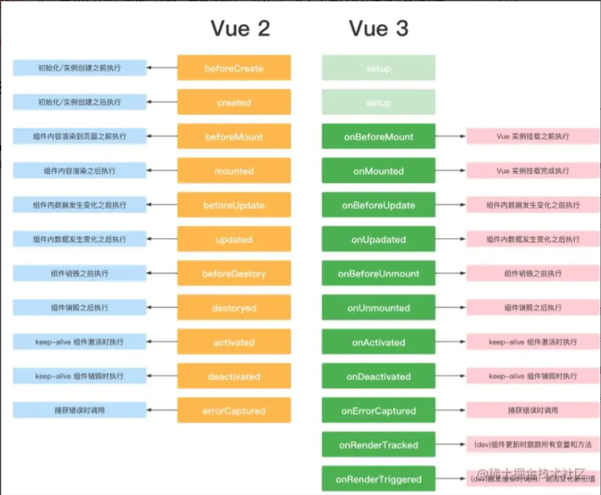
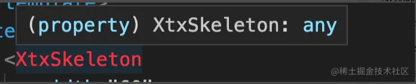

# 框架::2.vue3面试题

## 1. vue2和vue3的区别

1. 监测机制的改变
   1. vue3 中使用了ES6 的 ProxyAPI 对数据代理，监测的是整个对象，而不再是某个属性。
   2. 消除了 Vue 2 当中基于 Object.defineProperty 的实现所存在的很多限制
   3. vue3可以监测到对象属性的添加和删除，可以监听数组的变化；
   4. vue3支持 Map、Set、WeakMap 和 WeakSet。
2. Vue3支持碎片(Fragments)
   1. Vue2在组件中只有一个根节点。
   2. Vue3在组件可以拥有多个根节点。
3. API模式不同
   1. Vue2与Vue3 最大的区别：Vue2使用选项式API（Options API）对比Vue3组合式API（Composition API）
4. 建立数据的方式不同
   1. Vue2：这里把数据放入data属性中
   2. Vue3：需要使用一个新的setup()方法，此方法在组件初始化构造的时候触发。
   3. 使用以下三步来建立响应式数据:
      1. 从vue引入ref或reactive
      2. 简单数据类型使用ref()方法处理，复杂类型数据用reactive()处理
      3. 使用setup()方法来返回我们的响应性数据，从而我们的template可以获取这些响应性数据
5. 生命周期钩子不同 — Lifecyle Hooks
   1. setup() :开始创建组件之前，在beforeCreate和created之前执行。创建的是data和method
   2. onBeforeMount() : 组件挂载到节点上之前执行的函数。
   3. onMounted() : 组件挂载完成后执行的函数。
   4. onBeforeUpdate(): 组件更新之前执行的函数。
   5. onUpdated(): 组件更新完成之后执行的函数。
   6. onBeforeUnmount(): 组件卸载之前执行的函数。
   7. onUnmounted(): 组件卸载完成后执行的函数
   若组件被`<keep-alive>`包含，则多出下面两个钩子函数
   8. onActivated(): 被包含在中的组件，会多出两个生命周期钩子函数。被激活时执行 。
   9. onDeactivated(): 比如从 A组件，切换到 B 组件，A 组件消失时执行。
6. 父子传参不同，子组件通过defineProps()进行接收，并且接收这个函数的返回值进行数据操作。

总结： vue3 性能更高, 体积更小, 更利于复用, 代码维护更方便

## 2. defineProperty和proxy的区别

Vue 在实例初始化时遍历 data 中的所有属性，并使用 Object.defineProperty 把这些属性全部转为 getter/setter。并 劫持各个属性 getter 和 setter，在数据变化时发布消息给订阅者，触发相应的监听回调，而这之间存在几个问题

1. 初始化时需要遍历对象所有 key，如果对象层次较深，性能不好
2. 通知更新过程需要维护大量 dep 实例和 watcher 实例，额外占用内存较多
3. Object.defineProperty 无法监听到数组元素的变化，只能通过劫持重写数方法
4. 动态新增，删除对象属性无法拦截，只能用特定 set/delete API 代替
5. 不支持 Map、Set 等数据结构

Vue3 使用 Proxy 来监控数据的变化。Proxy 是 ES6 中提供的功能，其作用为：用于定义基本操作的自定义行为（如属性查找，赋值，枚举，函数调用等）。相对于`Object.defineProperty()`，其有以下特点：

1. Proxy 直接代理整个对象而非对象属性，这样只需做一层代理就可以监听同级结构下的所有属性变化，包括新增属性和删除属性。
2. 它的处理方式是在 getter 中去递归响应式，这样的好处是真正访问到的内部属性才会变成响应式，简单的可以说是按需实现响应式，减少性能消耗。
3. Proxy 可以监听数组的变化。

## 3. Vue3 Diff算法和 Vue2 的区别

我们知道在数据变更触发页面重新渲染，会生成虚拟 DOM 并进行 patch 过程，这一过程在 Vue3 中的优化有如下

* 编译阶段的优化：
  * 事件缓存：将事件缓存(如: @click)，可以理解为变成静态的了
  * 静态提升：第一次创建静态节点时保存，后续直接复用
  * 添加静态标记：给节点添加静态标记，以优化 Diff 过程

由于编译阶段的优化，除了能更快的生成虚拟 DOM 以外，还使得 Diff 时可以跳过"永远不会变化的节点"，

* Diff 优化如下
  * Vue2 是全量 Diff，Vue3 是静态标记 + 非全量 Diff
  * 使用最长递增子序列优化了对比流程

根据尤大公布的数据就是 Vue3 update 性能提升了 1.3~2 倍

## 4. composition API 与 options API的区别

* vue2 采用的就是 optionsAPI
  * (1) 优点:易于学习和使用, 每个代码有着明确的位置 (例如: 数据放 data 中, 方法放 methods中)
  * (2) 缺点: 相似的逻辑, 不容易复用, 在大项目中尤为明显
  * (3) 虽然 optionsAPI 可以通过mixins 提取相同的逻辑, 但是也并不是特别好维护
* vue3 新增的就是 compositionAPI
  * (1) compositionAPI 是基于 逻辑功能 组织代码的, 一个功能 api 相关放到一起
  * (2) 即使项目大了, 功能多了, 也能快速定位功能相关的 api
  * (3) 大大的提升了 代码可读性 和 可维护性
* vue3 推荐使用 composition API, 也保留了options API，即就算不用composition API, 用 vue2 的写法也完全兼容!!

## 5. Composition API与React Hook很像，区别是什么

从React Hook的实现角度看，React Hook是根据useState调用的顺序来确定下一次重渲染时的state是来源于哪个useState，所以出现了以下限制

* 不能在循环、条件、嵌套函数中调用Hook
* 必须确保总是在你的React函数的顶层调用Hook
* useEffect、useMemo等函数必须手动确定依赖关系

而Composition API是基于Vue的响应式系统实现的，与React Hook的相比

* 声明在setup函数内，一次组件实例化只调用一次setup，而React Hook每次重渲染都需要调用Hook，使得React的GC比Vue更有压力，性能也相对于Vue来说也较慢
* Compositon API的调用不需要顾虑调用顺序，也可以在循环、条件、嵌套函数中使用
* 响应式系统自动实现了依赖收集，进而组件的部分的性能优化由Vue内部自己完成，而React Hook需要手动传入依赖，而且必须必须保证依赖的顺序，让useEffect、useMemo等函数正确的捕获依赖变量，否则会由于依赖不正确使得组件性能下降。

虽然Compositon API看起来比React Hook好用，但是其设计思想也是借鉴React Hook的。

## 6. setup 函数

setup() 函数是 vue3 中，专门为组件提供的新属性。它为我们使用 vue3的 Composition API 新特性提供了统一的入口, setup 函数会在 beforeCreate 、created 之前执行, vue3也是取消了这两个钩子，统一用setup代替, 该函数相当于一个生命周期函数，vue中过去的data，methods，watch等全部都用对应的新增api写在setup()函数中
setup() 接收两个参数 props 和 context。它里面不能使用 this，而是通过 context 对象来代替当前执行上下文绑定的对象，context 对象有四个属性：attrs、slots、emit、expose
里面通过 ref 和 reactive 代替以前的 data 语法，return 出去的内容，可以在模板直接使用，包括变量和方法

```html
<template>
  <div class="container">
    <h1 @click="say()">{{msg}}</h1>
  </div>
</template>
​
<script>
export default {
  setup (props,context) {
    console.log('setup执行了')
    console.log(this)  // undefined
    // 定义数据和函数
    const msg = 'hi vue3'
    const say = () => {
      console.log(msg)
    }
    // Attribute (非响应式对象，等同于 $attrs)
    context.attrs
    // 插槽 (非响应式对象，等同于 $slots)
    context.slots
    // 触发事件 (方法，等同于 $emit)
    context.emit
    // 暴露公共 property (函数)
    context.expose
​
    return { msg , say}
  },
  beforeCreate() {
    console.log('beforeCreate执行了')
    console.log(this)  
  }
}
</script>
```

## 7. setup语法糖 （script setup语法）

script setup是在单文件组件 (SFC) 中使用组合式 API 的编译时语法糖。相比于普通的 script 语法更加简洁
要使用这个语法，需要将 setup attribute 添加到 `<script>` 代码块上：
格式：

```html
<script setup>
console.log('hello script setup')
</script>
```

顶层的绑定会自动暴露给模板，所以定义的变量，函数和import导入的内容都可以直接在模板中直接使用

```html
<template>
  <div>
    <h3>根组件</h3>
    <div>点击次数：{{ count }}</div>
    <button @click="add">点击修改</button>
  </div>
</template>
​
<script setup>
import { ref } from 'vue'
​
const count = ref(0)
const add = () => {
  count.value++
}
</script>
```

使用 setup 语法糖时，不用写 export default {}，子组件只需要 import 就直接使用，不需要像以前一样在 components 里注册，属性和方法也不用 return。
并且里面不需要用 async 就可以直接使用 await，因为这样默认会把组件的 setup 变为 async setup
用语法糖时，props、attrs、slots、emit、expose 的获取方式也不一样了
3.0~3.2版本变成了通过 import 引入的 API：defineProps、defineEmit、useContext(在3.2版本已废弃)，useContext 的属性 { emit, attrs, slots, expose }
3.2+版本不需要引入，而直接调用：defineProps、defineEmits、defineExpose、useSlots、useAttrs

## 8. reactive、 shallowReactive 函数

* reactive
reactive() 函数接收一个普通对象，返回一个响应式的数据对象, 相当于 Vue 2.x 中的 Vue.observable() API，响应式转换是“深层”的——它影响所有嵌套属性。基于proxy来实现，想要使用创建的响应式数据也很简单，创建出来之后，在setup中return出去，直接在template中调用即可
* shallowReactive
创建一个响应式代理，它跟踪其自身属性的响应性shallowReactive生成非递归响应数据，只监听第一层数据的变化，但不执行嵌套对象的深层响应式转换 (暴露原始值)。

## 9. ref、 shallowRef 、isRef、toRefs 函数

* ref
ref() 函数用来根据给定的值创建一个响应式的数据对象，ref() 函数调用的返回值是一个对象，这个对象上只包含一个 value 属性, 只在setup函数内部访问ref函数需要加.value，其用途创建独立的原始值
reactive 将解包所有深层的 refs，同时维持 ref 的响应性。当将 ref分配给 reactive property 时，ref 将被自动解包

```js
setup(){
  const count = ref<number>(10)
  const obj = reactive({
    t: 100,
    count
  })
  // 通过reactive来获取ref的值时，不需要使用.value属性，ref将自动被解包
  console.log(obj.count); //10
  console.log(obj.count === count.value); // true
}
```

* shallowRef
ref() 的浅层作用形式。shallowRef() 常常用于对大型数据结构的性能优化或是与外部的状态管理系统集成
* isRef
isRef() 用来判断某个值是否为 ref() 创建出来的对象
* toRefs
**使用场景: 如果对一个响应数据, 进行解构 或者 展开, 会丢失他的响应式特性!**
原因: vue3 底层是对 对象 进行监听劫持
作用: 对一个响应式对象的所有内部属性, 都做响应式处理
  1. reactive/ref的响应式功能是赋值给对象的, 如果给对象解构或者展开, 会让数据丢失响应式的能力
  2. 使用 toRefs 可以保证该对象展开的每个属性都是响应式的

## 10. readonly、isReadonly、shallowReadonly函数

* readonly
传入ref或 reactive对象,并返回一个原始对象的只读代理,对象内部任何嵌套的属性也都是只读的、 并且是递归只读。
* isReadonly
检查对象是否是由 readonly 创建的只读对象
* shallowReadonly
shallowReadonly 作用只处理对象最外层属性的响应式（浅响应式）的只读，但不执行嵌套对象的深度只读转换 (暴露原始值)

**readonly和const有什么区别？**

* const是赋值保护，使用const定义的变量，该变量不能重新赋值。但如果const赋值的是对象，那么对象里面的东西是可以改的。原因是const定义的变量不能改说的是，对象对应的那个地址不能改变
* 而readonly是属性保护，不能给属性重新赋值

## 11.computed、watch函数

* computed
该函数用来创造计算属性，和过去一样，它返回的值是一个ref对象。 里面可以传方法，或者一个对象，对象中包含set()、get()方法
* watch
watch 函数用来侦听特定的数据源，并在回调函数中执行副作用。默认情况是懒执行的，也就是说仅在侦听的源数据变更时才执行回调。

```js
// 监听单个ref
const money = ref(100)
watch(money, (value, oldValue) => {
  console.log(value)
})
​
// 监听多个ref
const money = ref(100)
const count = ref(0)
watch([money, count], (value) => {
  console.log(value)
})
​
// 监听ref复杂数据
const user = ref({
  name: 'zs',
  age: 18,
})
watch(
  user,
  (value) => {
    console.log('user变化了', value)
  },
  {
    // 深度监听，，，当ref的值是一个复杂数据类型，需要深度监听
    deep: true,
    immediate: true
  }
)
​
// 监听对象的某个属性的变化
const user = ref({
  name: 'zs',
  age: 18,
})
watch(
  () => user.value.name,
  (value) => {
    console.log(value)
  }
)
```

## 11. watch 和 watchEffect 的区别

watch 作用是对传入的某个或多个值的变化进行监听；触发时会返回新值和老值；也就是说第一次不会执行，只有变化时才会重新执行
watchEffect 是传入一个函数,会立即执行，所以默认第一次也会执行一次；不需要传入监听内容，会自动收集函数内的数据源作为依赖，在依赖变化的时候又会重新执行该函数，如果没有依赖就不会执行；而且不会返回变化前后的新值和老值
共同点是 watch 和 watchEffect 会共享以下四种行为：

* 停止监听：组件卸载时都会自动停止监听
* 清除副作用：onInvalidate 会作为回调的第三个参数传入
* 副作用刷新时机：响应式系统会缓存副作用函数，并异步刷新，避免同一个 tick 中多个状态改变导致的重复调用
* 监听器调试：开发模式下可以用 onTrack 和 onTrigger 进行调试

## 12. Vue3 的生命周期

基本上就是在 Vue2 生命周期钩子函数名基础上加了 on；beforeDestory 和 destoryed 更名为 onBeforeUnmount 和 onUnmounted；然后用setup代替了两个钩子函数 beforeCreate 和 created；新增了两个开发环境用于调试的钩子


## 13. setup语法下怎么设置name属性

安装插件

```shell
yarn add vite-plugin-vue-setup-extend -D
```

配置 vite.config.ts

```js
import vueSetupExtend from 'vite-plugin-vue-setup-extend'
​
export default defineConfig({
  plugins: [vue(), vueSetupExtend()],
})
```

在标签中使用

```html
<script setup name="MyCom">
    // 必须在script标签里面写一点类容，这个插件才会生效,哪怕是注释
</script>
```

## 14. Vue3怎么让全局组件有提示

vue3中如果注册的是局部组件，那么props是有类型提示的,但是如果注册的是全局组件，props就没有类型提示了

解决办法

```js
// 在src目录下新建一个文件 global.d.ts
import XtxSkeleton from '@/components/XtxSkeleton/XtxSkeleton.vue'
// 参考：
declare module 'vue' {
  export interface GlobalComponents {
    XtxSkeleton: typeof XtxSkeleton
  }
}
export {}
```

## 15. Vue3怎么注册全局自定义指令

```js
app.directive('lazy'，{  // app.directive('指令名‘，配置对象)
    mounted(el){
        .......
    }
})
```

## 16. Vite 和Webpack的区别

* 都是现代化打包工具
* 启动方式不一样。vite在启动的时候不需要打包，所以不用分析模块与模块之间的依赖关系，不用进行编译。这种方式就类似于我们在使用某个UI框架的时候，可以对其进行按需加载。同样的，vite也是这种机制，当浏览器请求某个模块时，再根据需要对模块内容进行编译。按需动态编译可以缩减编译时间，当项目越复杂，模块越多的情况下，vite明显优于webpack.
* 热更新方面，效率更高。当改动了某个模块的时候，也只用让浏览器重新请求该模块，不需要像webpack那样将模块以及模块依赖的模块全部编译一次。

缺点

* vite相关生态没有webpack完善，vite可以作为开发的辅助。

## 17. pinia的好处

* pinia和vuex4一样，也是vue 官方 状态管理工具(作者是 Vue 核心团队成员）
* pinia相比vuex4，对于vue3的 兼容性 更好
* pinia相比vuex4，具备完善的 类型推荐 => 对 TS 支持很友好
* pinia同样支持vue开发者工具
* Pinia 的 API 设计非常接近 Vuex 5 的提案

* pinia核心概念
  * state: 状态
  * actions: 修改状态（包括同步和异步，pinia中没有mutations）
  * getters: 计算属性

vuex只能有一个根级别的状态, pinia 直接就可以定义多个根级别状态

## 18. Vue3的v-model语法

1. 父组件给子组件传入一个modelValue的属性
2. 子组件通知父组件的update:modelValue事件，将修改后的值传给父组件
3. 父组件监听 update:modelValue，修改对应的值

```js
// 父组件
// 原生写法
<son :model-value="money" @update:modelValue="val=>money = val" />
// v-mode语法糖写法
<son v-model="money" v-mode:house="house" />
 // 子组件
<button @click="$emit('update:modelValue',modelValue+100)">点我加钱 </button>
```

* 好处是什么
  * 为了整合 .sync和v-model
  * 在Vue2中，v-mode只能绑定一个属性，如果需要绑定多个属性则需要借助.sync修饰符
  * .sync修饰符在Vue3中已被移除，直接被v-model取代。
