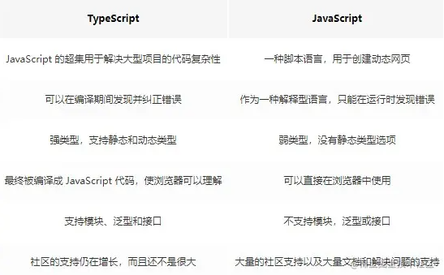

# 框架::4.ts面试题

## 1. TypeScript 是什么

TypeScript，简称 ts，是微软开发的一种静态的编程语言，它是 JavaScript 的超集。 那么它有什么特别之处呢?

简单来说，js 有的 ts 都有，所有js 代码都可以在 ts 里面运行。
ts 支持类型支持，ts = type +JavaScript。

## 2. TypeScript 与 JavaScript 的区别



## 3.TypeScript的类型①、 基础类型

1.1 Boolean 、Number 、String 、Symbol

```ts
let isDone: boolean = false;
// ES5：var isDone = false;

let count: number = 10;
// ES5：var count = 10;

let name: string = "semliker";
// ES5：var name = 'semlinker';

const sym = Symbol();
let obj = {
  [sym]: "semlinker",
};
​
console.log(obj[sym]); // semlinker

```

1.2 Array、Tuple (元组)

```ts
let list: number[] = [1, 2, 3];
// ES5：var list = [1,2,3];

let list: Array<number> = [1, 2, 3]; // Array<number>泛型语法
// ES5：var list = [1,2,3];
```

Tuple
数组一般由同种类型的值组成，但有时我们需要在单个变量中存储不同类型的值，这时候我们就可以使用元组。在 JavaScript 中是没有元组的，元组是 TypeScript 中特有的类型，其工作方式类似于数组。
元组可用于定义具有有限数量的未命名属性的类型。每个属性都有一个关联的类型。使用元组时，必须提供每个属性的值。

```ts
let position: [number, number] = [39.5427, 116.2317]
```

1.3 undefined 、 null

默认情况下 null 和 undefined 是所有类型的子类型。 就是说你可以把 null 和 undefined 赋值给 number 类型的变量。

```ts
let age: number = null
let realName: string = undefined

```

1.4 any、unknown 、never

* any

在 TypeScript 中，任何类型都可以被归为 any 类型。这让any类型成为了类型系统的顶级类型（也被称作全局超级类型）。但是不建议使用 any，不然就丧失了 TS 提供的保护机制，失去了使用TS的意义。

* unknown

所有类型也都可以赋值给 unknown。这使得 unknown 成为 TypeScript 类型系统的另一种顶级类型（另一种是 any）。它的定义和 any 定义很像，但是它是一个安全类型，使用 unknown 做任何事情都是不合法的。

* never

never类型表示的是那些永不存在的值的类型。
有些情况下值会永不存在，比如，

* 如果一个函数执行时抛出了异常，那么这个函数永远不存在返回值，因为抛出异常会直接中断程序运行。
* 函数中执行无限循环的代码，使得程序永远无法运行到函数返回值那一步。

never 类型是任何类型的子类型，也可以赋值给任何类型。
没有类型是 never 的子类型，没有类型可以赋值给 never 类型（除了 never 本身之外）。 即使 any也不可以赋值给 never 。

## 3.TypeScript的类型②、 函数类型

函数的类型实际上指的是：函数参数和返回值的类型

为函数指定类型的两种方式：

单独指定参数、返回值的类型
同时指定参数、返回值的类型

单独指定参数、返回值的类型：

```ts
// 函数声明
function add(num1: number, num2: number): number {
  return num1 + num2
}
​
// 箭头函数
const add = (num1: number, num2: number): number => {
  return num1 + num2
}

```

同时指定参数、返回值的类型:

```ts
type AddFn = (num1: number, num2: number) => number
​
const add: AddFn = (num1, num2) => {
  return num1 + num2
}

```

2.2 void 类型

如果函数没有返回值，那么，函数返回值类型为：void

```ts
function greet(name: string): void {
  console.log('Hello', name)
}

```

注意：

如果一个函数没有返回值，此时，在 TS 的类型中，应该使用 void 类型

```ts
// 如果什么都不写，此时，add 函数的返回值类型为： void
const add = () => {}
// 这种写法是明确指定函数返回值类型为 void，与上面不指定返回值类型相同
const add = (): void => {}
​
// 但，如果指定 返回值类型为 undefined，此时，函数体中必须显示的 return undefined 才可以
const add = (): undefined => {
  // 此处，返回的 undefined 是 JS 中的一个值
  return undefined
}

```

2.3 可选参数

使用函数实现某个功能时，参数可以传也可以不传。这种情况下，在给函数参数指定类型时，就用到可选参数了
比如，数组的 slice 方法，可以 slice() 也可以 slice(1) 还可以 slice(1, 3)

```ts
function mySlice(start?: number, end?: number): void {
  console.log('起始索引：', start, '结束索引：', end)
}

```

可选参数：在可传可不传的参数名称后面添加 ?（问号）
注意：可选参数只能出现在参数列表的最后，也就是说可选参数后面不能再出现必选参数

2.4 默认参数

跟 JS 的写法一样，在入参里定义初始值。
和可选参数不同的是，默认参数可以不放在函数入参的最后面

2.5 函数重载

函数重载或方法重载是使用相同名称和不同参数数量或类型创建多个方法的一种能力。
不必太纠结函数重载，知道有这个概念即可，平时一般用泛型来解决类似问题。

## 3.TypeScript的类型③、 对象类型

JS 中的对象是由属性和方法构成的，而 TS 对象的类型就是在描述对象的结构（有什么类型的属性和方法）
对象类型的写法:

```ts
// 空对象
let person: {} = {}
​
// 有属性的对象
let person: { name: string } = {
  name: '同学'
}
​
// 既有属性又有方法的对象
// 在一行代码中指定对象的多个属性类型时，使用 `;`（分号）来分隔
let person: { name: string; sayHi(): void } = {
  name: 'jack',
  sayHi() {}
}
​
// 对象中如果有多个类型，可以换行写：
// 通过换行来分隔多个属性类型，可以去掉 `;`
let person: {
  name: string
  sayHi(): void
} = {
  name: 'jack',
  sayHi() {}
}
​
// 方法的类型也可以使用箭头函数形式
{
    greet(name: string):string,
    greet: (name: string) => string
}

```

3.2 对象可选属性

对象的属性或方法，也可以是可选的，此时就用到可选属性了
比如，我们在使用 axios({ ... }) 时，如果发送 GET 请求，method 属性就可以省略
可选属性的语法与函数可选参数的语法一致，都使用 ? 来表示

```ts
type Config = {
  url: string
  method?: string
}
​
function myAxios(config: Config) {
  console.log(config)
}

```

## 3.TypeScript的类型④、 interface 接口类型

当一个对象类型被多次使用时，一般会使用接口（interface）来描述对象的类型，达到复用的目的

解释：

使用 interface 关键字来声明接口
接口名称(比如，此处的 IPerson)，可以是任意合法的变量名称，推荐以 I 开头
声明接口后，直接使用接口名称作为变量的类型
因为每一行只有一个属性类型，因此，属性类型后没有 ;(分号)

```ts
interface IPerson {
  name: string
  age: number
  sayHi(): void
}
​
​
let person: IPerson = {
  name: 'jack',
  age: 19,
  sayHi() {}
}

```

4.2 接口继承

如果两个接口之间有相同的属性或方法，可以将公共的属性或方法抽离出来，通过继承来实现复用
比如，这两个接口都有 x、y 两个属性，重复写两次，可以，但很繁琐

```ts
interface Point2D { x: number; y: number }
// 继承 Point2D
interface Point3D extends Point2D {
  z: number
}

```

4.3 interface 和 type的区别

interface（接口）和 type（类型别名）的对比：

相同点：都可以给对象指定类型

不同点:

interface ：

只能为对象指定类型
可以使用extends继承
多个同名的interface会合并

type：

不仅可以为对象指定类型，实际上可以为任意类型指定别名
可以使用&运算符实现继承效果
多个同名的type会报错

## 3.TypeScript的类型⑤、 联合类型

```ts
let arr: (number | string)[] = [1, 'a', 3, 'b']

```

解释：|（竖线）在 TS 中叫做联合类型，即：由两个或多个其他类型组成的类型，表示可以是这些类型中的任意一种
注意：这是 TS 中联合类型的语法，只有一根竖线，不要与 JS 中的或（|| 或）混淆了

## 3.TypeScript的类型⑥、字面量类型、枚举(enum)类型

字面量类型

```ts
const str = 'Hello TS'

```

str 是一个常量(const)，它的值不能变化只能是 'Hello TS'，所以，它的类型为:'Hello TS'

注意：此处的 'Hello TS'，就是一个字面量类型，也就是说某个特定的字符串也可以作为 TS 中的类型

任意的 JS 字面量（比如，对象、数字等）都可以作为类型使用

字面量：{ name: 'jack' } [] 18 20 'abc' false function() {}

枚举类型
在任何项目开发中，我们都会遇到定义常量的情况，常量就是指不会被改变的值。
TS 中我们使用 const 来声明常量，但是有些取值是在一定范围内的一系列常量，比如一周有七天，比如方向分为上下左右四个方向。
这时就可以使用枚举（Enum）来定义。

```ts
// 创建枚举
enum Direction { Up, Down, Left, Right }
​
// 使用枚举类型
function changeDirection(direction: Direction) {
  console.log(direction)
}
​
// 调用函数时，需要应该传入：枚举 Direction 成员的任意一个
// 类似于 JS 中的对象，直接通过 点（.）语法 访问枚举的成员
changeDirection(Direction.Up)

```

枚举实现原理

枚举是 TS 为数不多的非 JavaScript 类型级扩展(不仅仅是类型)的特性之一
因为：其他类型仅仅被当做类型，而枚举不仅用作类型，还提供值(枚举成员都是有值的)
也就是说，其他的类型会在编译为 JS 代码时自动移除。但是，枚举类型会被编译为 JS 代码

```ts
enum Direction {
  Up = 'UP',
  Down = 'DOWN',
  Left = 'LEFT',
  Right = 'RIGHT'
}
​
// 会被编译为以下 JS 代码：
var Direction;
​
(function (Direction) {
  Direction['Up'] = 'UP'
  Direction['Down'] = 'DOWN'
  Direction['Left'] = 'LEFT'
  Direction['Right'] = 'RIGHT'
})(Direction || Direction = {})

```

说明：枚举与前面讲到的字面量类型+联合类型组合的功能类似，都用来表示一组明确的可选值列表
一般情况下，推荐使用字面量类型+联合类型组合的方式，因为相比枚举，这种方式更加直观、简洁、高效

## 4. TS中的class类的关键字

* extends
在 TypeScript 中，我们可以通过 extends 关键字来实现继承
* super
子类没有定义自己的属性，可以不写 super ，但是如果子类有自己的属性，就要用到 super 关键字来把父类的属性继承过来。
* public
public，公有的，一个类里默认所有的方法和属性都是 public。
* private
private，私有的，只属于这个类自己，它的实例和继承它的子类都访问不到。
* protected
protected 受保护的，继承它的子类可以访问，实例不能访问。
* static
static 是静态属性，可以理解为是类上的一些常量，实例不能访问。
* abstract
abstract 关键字来定义抽象类和抽象方法
抽象类，是指只能被继承，但不能被实例化的类，就这么简单。
抽象类有两个特点：
  * 抽象类不允许被实例化
  * 抽象类中的抽象方法必须被子类实现

* （私有字段）
私有字段与常规属性（甚至使用 private 修饰符声明的属性）不同，私有字段要牢记以下规则：
  * 私有字段以 # 字符开头，有时我们称之为私有名称；
  * 每个私有字段名称都唯一地限定于其包含的类；
  * 不能在私有字段上使用 TypeScript 可访问性修饰符（如 public 或 private）；
  * 私有字段不能在包含的类之外访问，甚至不能被检测到。

## 5. 类型推断、类型断言、非空断言5.1 类型推断

在 TS 中，某些没有明确指出类型的地方，TS 的类型推论机制会帮助提供类型 换句话说：由于类型推论的存在，有些场合下的类型注解可以省略不写
发生类型推论的 2 种常见场景:

声明变量并初始化时
决定函数返回值时

```ts
// 变量 age 的类型被自动推断为：number
let age = 18
​
// 函数返回值的类型被自动推断为：number
function add(num1: number, num2: number) {
  return num1 + num2
}

```

## 5. 类型推断、类型断言、非空断言5.2 类型断言

有时候你会比 TS 更加明确一个值的类型，此时，可以使用类型断言来指定更具体的类型。
类型断言好比其他语言里的类型转换，但是不进行特殊的数据检查和解构。它没有运行时的影响，只是在编译阶段起作用。

```ts
const aLink = document.getElementById('link') as HTMLAnchorElement

```

另一种语法，使用 <> 语法，这种语法形式不常用，知道即可:

```ts
// 尖括号语法，知道即可：
const aLink = <HTMLAnchorElement>document.getElementById('link')

```

## 5. 类型推断、类型断言、非空断言5.3 非空断言

在上下文中当类型检查器无法断定类型时，一个新的后缀表达式操作符 ! 可以用于断言操作对象是非 null 和非 undefined 类型。具体而言，x! 将从 x 值域中排除 null 和 undefined 。

```ts
const aLink = document.getElementById('link')!
 //如果没有非空断言，使用aLink时会报错，因为页面可能没有link这个标签，得到的就是undefined

```

## 6. 泛型6.1 泛型-基本介绍

泛型是可以在保证类型安全前提下，让函数等与多种类型一起工作，从而实现复用，常用于：函数、接口、class 中
需求：创建一个 id 函数，传入什么数据就返回该数据本身(也就是说，参数和返回值类型相同)

```ts
function id(value: number): number { return value }

```

比如，id(10) 调用以上函数就会直接返回 10 本身。但是，该函数只接收数值类型，无法用于其他类型
为了能让函数能够接受任意类型，可以将参数类型修改为 any。但是，这样就失去了 TS 的类型保护，类型不安全

```ts
function id(value: any): any { return value }

```

泛型在保证类型安全(不丢失类型信息)的同时，可以让函数等与多种不同的类型一起工作，灵活可复用
实际上，在 C# 和 Java 等编程语言中，泛型都是用来实现可复用组件功能的主要工具之一

## 6. 泛型6.2 泛型函数

定义泛型函数

```ts
function id<Type>(value: Type): Type { return value }
​
function id<T>(value: T): T { return value }

```

解释:

语法：在函数名称的后面添加 <>(尖括号)，尖括号中添加类型变量，比如此处的 Type
类型变量 Type，是一种特殊类型的变量，它处理类型而不是值
该类型变量相当于一个类型容器，能够捕获用户提供的类型(具体是什么类型由用户调用该函数时指定)
因为 Type 是类型，因此可以将其作为函数参数和返回值的类型，表示参数和返回值具有相同的类型
类型变量 Type，可以是任意合法的变量名称

调用泛型函数

```ts
const num = id<number>(10)
const str = id<string>('a')

```

解释：

语法：在函数名称的后面添加 <>(尖括号)，尖括号中指定具体的类型，比如，此处的 number
当传入类型 number 后，这个类型就会被函数声明时指定的类型变量 Type 捕获到
此时，Type 的类型就是 number，所以，函数 id 参数和返回值的类型也都是 number

同样，如果传入类型 string，函数 id 参数和返回值的类型就都是 string

这样，通过泛型就做到了让 id 函数与多种不同的类型一起工作，实现了复用的同时保证了类型安全

简化泛型函数调用

```ts
// 省略 <number> 调用函数
let num = id(10)
let str = id('a')

```

解释:

在调用泛型函数时，可以省略 <类型> 来简化泛型函数的调用
此时，TS 内部会采用一种叫做类型参数推断的机制，来根据传入的实参自动推断出类型变量 Type 的类型
比如，传入实参 10，TS 会自动推断出变量 num 的类型 number，并作为 Type 的类型

推荐：使用这种简化的方式调用泛型函数，使代码更短，更易于阅读

说明：当编译器无法推断类型或者推断的类型不准确时，就需要显式地传入类型参数

## 6. 泛型6.3 泛型约束

默认情况下，泛型函数的类型变量 Type 可以代表多个类型，这导致无法访问任何属性
比如，id('a') 调用函数时获取参数的长度：

```ts
function id<Type>(value: Type): Type {
  console.log(value.length)
  return value
}
​
id('a')

```

解释：Type 可以代表任意类型，无法保证一定存在 length 属性，比如 number 类型就没有 length
此时，就需要为泛型添加约束来收缩类型(缩窄类型取值范围)
添加泛型约束收缩类型，主要有以下两种方式：1 指定更加具体的类型 2 添加约束

指定更加具体的类型
比如，将类型修改为 Type[](Type 类型的数组)，因为只要是数组就一定存在 length 属性，因此就可以访问了

```ts
function id<Type>(value: Type[]): Type[] {
  console.log(value.length)
  return value
}

```

添加约束

```ts
// 创建一个接口
interface ILength { length: number }
​
// Type extends ILength 添加泛型约束
// 解释：表示传入的 类型 必须满足 ILength 接口的要求才行，也就是得有一个 number 类型的 length 属性
function id<Type extends ILength>(value: Type): Type {
  console.log(value.length)
  return value
}

```

解释:

创建描述约束的接口 ILength，该接口要求提供 length 属性
通过 extends 关键字使用该接口，为泛型(类型变量)添加约束
该约束表示：传入的类型必须具有 length 属性

注意:传入的实参(比如，数组)只要有 length 属性即可（类型兼容性)

## 6. 泛型6.4 多个类型变量

泛型的类型变量可以有多个，并且类型变量之间还可以约束(比如，第二个类型变量受第一个类型变量约束) 比如，创建一个函数来获取对象中属性的值：

```ts
function getProp<Type, Key extends keyof Type>(obj: Type, key: Key) {
  return obj[key]
}
let person = { name: 'jack', age: 18 }
getProp(person, 'name')

```

解释:

添加了第二个类型变量 Key，两个类型变量之间使用 , 逗号分隔。
keyof 关键字接收一个对象类型，生成其键名称(可能是字符串或数字)的联合类型。
本示例中 keyof Type 实际上获取的是 person 对象所有键的联合类型，也就是：'name' | 'age'
类型变量 Key 受 Type 约束，可以理解为：Key 只能是 Type 所有键中的任意一个，或者说只能访问对象中存在的属性

```ts
// Type extends object 表示： Type 应该是一个对象类型，如果不是 对象 类型，就会报错
// 如果要用到 对象 类型，应该用 object ，而不是 Object
function getProperty<Type extends object, Key extends keyof Type>(obj: Type, key: Key) {
  return obj[key]
}

```

## 6. 泛型6.5 泛型接口

泛型接口：接口也可以配合泛型来使用，以增加其灵活性，增强其复用性

```ts
interface IdFunc<Type> {
  id: (value: Type) => Type
  ids: () => Type[]
}
​
let obj: IdFunc<number> = {
  id(value) { return value },
  ids() { return [1, 3, 5] }
}

```

解释:

在接口名称的后面添加 <类型变量>，那么，这个接口就变成了泛型接口。
接口的类型变量，对接口中所有其他成员可见，也就是接口中所有成员都可以使用类型变量。
使用泛型接口时，需要显式指定具体的类型(比如，此处的 IdFunc)。
此时，id 方法的参数和返回值类型都是 number;ids 方法的返回值类型是 number[]。

## 7. TS内置的常用工具类型7.1 typeof

在 TypeScript 中，typeof 操作符可以用来获取一个变量声明或对象的类型。

```ts
interface Person {
  name: string;
  age: number;
}
​
const sem: Person = { name: 'semlinker', age: 33 };
type Sem= typeof sem; // -> Person
​
function toArray(x: number): Array<number> {
  return [x];
}
​
type Func = typeof toArray; // -> (x: number) => number[]
​

```

## 7. TS内置的常用工具类型7.2 keyof

keyof 操作符是在 TypeScript 2.1 版本引入的，该操作符可以用于获取某种类型的所有键，其返回类型是联合类型。

```ts
interface Person {
  name: string;
  age: number;
}
​
type K1 = keyof Person; // "name" | "age"
type K2 = keyof Person[]; // "length" | "toString" | "pop" | "push" | "concat" | "join"
type K3 = keyof { [x: string]: Person };  // string | number
​

```

## 7. TS内置的常用工具类型7.3 in

in 用来遍历枚举类型：

```ts
type Keys = "a" | "b" | "c"
​
type Obj =  {
} // -> { a: any, b: any, c: any }

```

## 7. TS内置的常用工具类型7.4 infer

在条件类型语句中，可以用 infer 声明一个类型变量并且对它进行使用。

```ts
type ReturnType<T> = T extends (
  ...args: any[]
) => infer R ? R : any;

```

以上代码中 infer R 就是声明一个变量来承载传入函数签名的返回值类型，简单说就是用它取到函数返回值的类型方便之后使用。

## 7. TS内置的常用工具类型7.5 extends

有时候我们定义的泛型不想过于灵活或者说想继承某些类等，可以通过 extends 关键字添加泛型约束。

```ts
interface Lengthwise {
  length: number;
}
​
function loggingIdentity<T extends Lengthwise>(arg: T): T {
  console.log(arg.length);
  return arg;
}
​

```

## 7. TS内置的常用工具类型7.6 Partial、Readonly、Required

Partial<T> 的作用就是将某个类型里的属性全部变为可选项 ?。

```ts
type Partial<T> = {
  [P in keyof T]?: T[P];
};

```

在以上代码中，首先通过 keyof T 拿到 T 的所有属性名，然后使用 in 进行遍历，将值赋给 P，最后通过 T[P] 取得相应的属性值。中间的 ? 号，用于将所有属性变为可选。
Readonly<T>
将 T 中的所有属性设置为只读
Required<T>
将 T 中的所有属性设置为必须

## 7. TS内置的常用工具类型7.7 Omit

Omit<T, U>从类型 T 中剔除 U 中的所有属性

```ts
interface IPerson {
    name: string
    age: number
}
​
type IOmit = Omit<IPerson, 'age'>
// 这样就剔除了 IPerson 上的 age 属性。

```

## 8. Vue3中父子传值 , 用TS怎么写，怎么设置默认值

```ts
// 用泛型来约束收到的数据
// TS的defineProps写法 , defineProps<....>()
const {msg='123'}defineProps<{  //设置默认值需要解构，并且添加全局配置
  msg？: string,
  arr: { name: string }[]
}>()
// 用TS来子传父  defineEmits<(...):void>()
const emit = defineEmits<{
  (e: 'changeMsg', val: string): void
  (e: 'addMsg'): void
}>()

```

默认值的全局配置

## 9. TS怎么给引入的第三方库设置类型声明文件

目前，几乎所有常用的第三方库都有相应的类型声明文件

第三方库的类型声明文件有两种存在形式：

1 、库自带类型声明文件

2、 由 TS官方给它写的（DefinitelyTyped 提供）

库自带类型声明文件：比如，axios
这种情况下，正常导入该库，TS 就会自动加载库自己的类型声明文件，以提供该库的类型声明。
由 DefinitelyTyped 提供：

DefinitelyTyped 是一个 github 仓库，用来提供高质量 TypeScript 类型声明
可以通过 npm/yarn 来下载该仓库提供的 TS 类型声明包，这些包的名称格式为:@types/*比如，@types/react、@types/lodash 等
在实际项目开发时，如果你使用的第三方库没有自带的声明文件，VSCode 会给出明确的提示

## 10. 说说你对 TypeScript 装饰器的理解？

装饰器是一种特殊类型的声明，它能够被附加到类声明，方法， 访问符，属性或参数上
是一种在不改变原类和使用继承的情况下，动态地扩展对象功能
同样的，本质也不是什么高大上的结构，就是一个普通的函数，@expression 的形式其实是Object.defineProperty的语法糖
expression求值后必须也是一个函数，它会在运行时被调用，被装饰的声明信息做为参数传入

## 11. 说说对 TypeScript 中命名空间与模块的理解

* 模块
TypeScript 与ECMAScript 2015 一样，任何包含顶级 import 或者 export 的文件都被当成一个模块
相反地，如果一个文件不带有顶级的import或者export声明，那么它的内容被视为全局可见的
* 命名空间
命名空间一个最明确的目的就是解决重名问题
命名空间定义了标识符的可见范围，一个标识符可在多个名字空间中定义，它在不同名字空间中的含义是互不相干的
这样，在一个新的名字空间中可定义任何标识符，它们不会与任何已有的标识符发生冲突，因为已有的定义都处于其他名字空间中

## 12. TS怎么自定义类型声明文件

如下两种场景需要提供类型声明文件

项目内共享类型
为已有 JS 文件提供类型声明

## 12.1 项目内共享类型

将公共的类型定义提取出来，写在index.d.ts文件中 , 并导出

```ts
export interface Token {
  token: string
  refreshToken: string
}

```

导入接口并使用

```ts
<script setup lang='ts'>
import {Token} from '.'
function fn(token:Token){
  
}
</script>

```

## 12.2 为已有 JS 文件提供类型声明

编写同名的.d.ts文件

```ts
demo.ts
utils/index.js
utils/index.d.ts // 这里是重点

```

定义类型声明文件

它的作用是提供声明，不需要提供逻辑代码；
declare 关键字:用于类型声明，为其他地方(比如，.js 文件)已存在的变量声明类型，而不是创建一个新的变量。

对于 type、interface 等这些明确就是 TS 类型的(只能在 TS 中使用的)，可以省略 declare 关键字。
对于 let、function 等具有双重含义(在 JS、TS 中都能用)，应该使用 declare 关键字，明确指定此处用于类型声明。

```ts
export declare let count = number
export declare let songName = string
export declare let position = {
  x: number,
  y: number
}
export declare function add(x: number, y: number): number {
​
}
enum Direction {
  'top',
  'right',
  'bottom',
  'left'
}
export declare function changeDirection(direction: Direction): void
type FomatPoint = (point: number) => void
export declare const fomatPoint: FomatPoint
```
