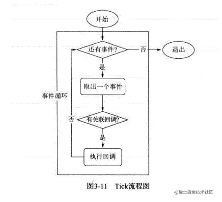
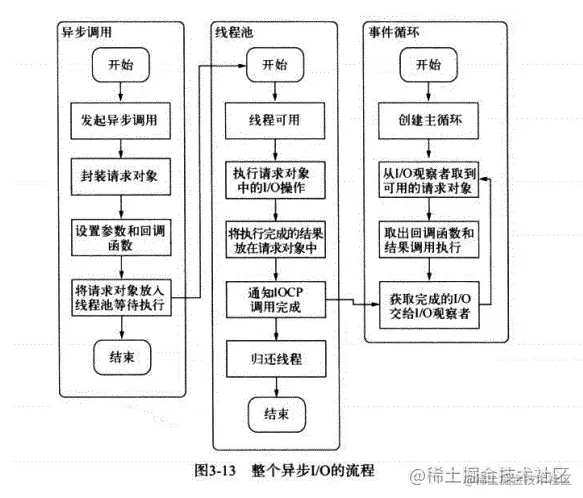

# 框架::5.Node

## 1. Node是什么?

Node.js是一个基于 Chrome V8 引擎的**JavaScript运行环境**，这个环境就好比是服务器上的浏览器（虽然不是很恰当），但正是因为有了它才使得 js 变成了一门后台语言。

## 2. Node解决了哪些问题?

Node在处理高并发,I/O密集场景有明显的性能优势

* 高并发,是指在同一时间并发访问服务器
* I/O密集指的是文件操作、网络操作、数据库,相对的有CPU密集,CPU密集指的是逻辑处理运算、压缩、解压、加密、解密

> Web主要场景就是接收客户端的请求读取静态资源和渲染界面,所以Node非常适合Web应用的开发。

## 3. Node 的应用场景

一般来说，node 主要应用于以下几个方面：

* 自动化构建等工具
* 中间层
* 小项目

第一点对于前端同学来说应该是重中之重了，什么工程化、自动构建工具就是用 node 写出来的，它是前端的一大分水岭之一

## 4. 请介绍一下Node事件循环的流程

* 在进程启动时，Node便会创建一个类似于while(true)的循环，每执行一次循环体的过程我们成为Tick。
* 每个Tick的过程就是查看是否有事件待处理。如果有就取出事件及其相关的回调函数。然后进入下一个循环，如果不再有事件处理，就退出进程。

### 4.2 浏览器和 Node.js 中的事件循环机制有什么区别？

Node.js中宏任务分成了几种类型，并且放在了不同的task queue(事件队列)里。不同的task queue在执行顺序上也有区别，微任务放在了每个task queue的末尾：

* `setTimeout/setInterval` 属于 timers 类型；
* `setImmediate` 属于 check 类型；
* socket 的 close 事件属于 close callbacks 类型；
* 其他 MacroTask 都属于 poll 类型。
* `process.nextTick` 本质上属于 MicroTask，但是它先于所有其他 MicroTask 执行；
* 所有 MicroTask 的执行时机在不同类型的 MacroTask 切换后。
* idle/prepare 仅供内部调用，我们可以忽略。
* pending callbacks 不太常见，我们也可以忽略。

## 5. 在每个tick的过程中，如何判断是否有事件需要处理呢？

-

* 每个事件循环中有一个或者多个观察者，而判断是否有事件需要处理的过程就是向这些观察者询问是否有要处理的事件。
* 在Node中，事件主要来源于网络请求、文件的I/O等，这些事件对应的观察者有文件I/O观察者，网络I/O的观察者。
* 事件循环是一个典型的生产者/消费者模型。异步I/O，网络请求等则是事件的生产者，源源不断为Node提供不同类型的事件，这些事件被传递到对应的观察者那里，事件循环则从观察者那里取出事件并处理。
* 在windows下，这个循环基于IOCP创建，在*nix下则基于多线程创建

## 6. 请描述一下整个异步I/O的流程

## 7. Express

### 7.1 Express框架介绍

1.Express是NodeJS开发中一个非常重量级的第三方框架，它对于NodeJS服务端就相当于Jquery对于HTML客户端。

* **如果连Express都不会用，基本上都不好意思跟别人说你会NodeJS**

2.Express官网是这样介绍自己的:基于 Node.js 平台，快速、开放、极简的 web 开发框架。

* _Express一个非常重要的亮点就是它没有改变nodejs已有的特性，而是在它的基础上进行了拓展_

  * **也就是说，使用Express你既可以使用nodejs原生的任何API，也能使用Express的API**

### 7.2 Express三大核心功能

* 1.托管静态资源

  * 第二天讲的nodejs实现静态服务器功能在express中只需要一行代码
* 2.路由

  * express自带路由功能,让Node服务端开发变得极其简单
  * express支持链式语法，可以让代码看起来更加简洁
* ==3.中间件==

  * Express最为核心的技术和思想，万物皆中间件

    * 中间件虽然理解起来有点困难，但是使用起来非常方便，类似于`bootstrap插件`.

## 8. Node模块化规范

-

### 8.1 什么是模块化? 模块化有什么好处?

* 1.什么叫模块化？（模块 == js文件）

  * `一个js文件`可以`引入另一个js文件中的数据`, 这种开发方式就叫做模块化开发
* 2.模块化开发好处？

  * （1）将功能分离出来

    * 一个js文件只负责处理一个功能，这样做的好处是业务逻辑清晰，便于维护
  * （2）按需导入

    * 用到哪一个功能，就导入哪一个js文件。模块化开发是`渐进式框架`的共同特征。
  * （3）避免变量污染

    * 一个js文件(模块),都是一个独立的作用域。 互不干扰，不用考虑变量名冲突问题。

### 8.2 模块化语法规范介绍

任何一个语法，都需要遵循一定的规范。不同的平台需要遵循的规范不同。一般情况下，模块化语法规范主要有三种。

* CommonJS 规范：nodejs 默认支持的

  * 文档：[javascript.ruanyifeng.com/nodejs/modu…](https://link.juejin.cn?target=http%3A%2F%2Fjavascript.ruanyifeng.com%2Fnodejs%2Fmodule.html%23toc1 "http://javascript.ruanyifeng.com/nodejs/module.html#toc1")
* ES6规范：前端的ES6语法支持的规范

  * 文档：[es6.ruanyifeng.com/#docs/modul…](https://link.juejin.cn?target=https%3A%2F%2Fes6.ruanyifeng.com%2F%23docs%2Fmodule "https://es6.ruanyifeng.com/#docs/module")
* CMD 和 AMD 模块化规范 ： ES6语法之前的模块化语法规范，现在已经几乎不用了

### 8.3 CommonJS规范实现模块化语法

* CommonJS规范只有两句话

  * 1.模块必须要使用 `require()` 导入

  * 2.模块必须要使用 `module.exports` 导出

    * 这两个语法都是nodejs环境自带的全局语法

* exports与module.exports区别

  * (1)如果分不清两者区别,就使用 `module.exports`

  * (2)exports不能去修改堆地址，只能往堆地址里面加数据

    * 错误写法： exports = { name:'张三' }

      * 这样写是修改堆地址
    * 正确写法: exports.name = '张三'

      * 这样写没有修改堆地址，而是往堆地址中加数据

### 8.4 模块缓存机制

* 1.当一个模块第一次会加载时，nodejs会执行里面的js代码，并且导出模块
* 2.nodejs会将导出的模块放入缓存中
* 3.当重复导入一个模块的时候，nodejs会先从缓存中读取模块。 如果缓存中有，就从缓存读取。缓存没有重复步骤1

### 8.5 nodejs三种模块及require()加载原理

* 1.nodejs有三种模块

  * 第一种： 核心模块、内置模块

    * nodejs作者写的，这些模块js文件会随着安装nodejs的时候一起安装。因此我们可以直接使用，而无需下载。

      * 例如： fs 、path、http都是核心模块
  * 第二种：第三方模块

    * npm官网上面的模块，这些都是大佬写的模块。需要下载后使用

      * 例如： express、cors、bod-parser
  * 第三种：自定义模块

    * 我们自己写的js文件

* 2.require('文件路径')加载原理

  * (1)自定义模块：必须要写文件路径， `require()`会得到这个模块里面的 `module.exports` 对象

  * (2)第三方模块 ：写模块名。 nodejs会自动从你的node_module文件夹里面去找这个模块的名字，然后执行模块里面的`index.js`代码，得到里面的`module.exports`

    * 如果当前目录没有module.exports就会从上级目录找，以此类推。一直找到你的磁盘根目录。 还找不到就会报错提示 模块不存在（有点类似于变量作用域就近原则）
  * (3)核心模块：写模块名。 nodejs会自动从你的node安装包路径里面去找。

### 8.6 require和import的区别

1. 导入`require` 导出 `exports/module.exports` 是 `CommonJS` 的标准，通常适用范围如 `Node.js`
2. import/export`是`ES6` 的标准，通常适用范围如 React
3. `require` 是**赋值过程**并且是**运行时才执行**，也就是_**同步加载**_
4. `require` 可以理解为一个全局方法，因为它是一个方法所以意味着可以在任何地方执行。
5. `import` 是**解构过程**并且是**编译时执行**，理解为_**异步加载**_
6. `import` 会提升到整个模块的头部，具有置顶性，但是建议写在文件的顶部。

## 9. 说说前端渲染和后端渲染，以及他们的优缺点

**前端渲染**

指的是后端返回JSON数据，前端利用预先写的html模板，循环读取JSON数据，拼接字符串（ES6的模板字符串特性大大减少了拼接字符串的的成本），并插入页面。

**后端渲染**

前端请求，后端用后台模板引擎直接生成html，前端接收到数据之后，直接插入页面。

**区别**

前端渲染

后端渲染

页面呈现速度

主要受限于带宽和客户端机器的好坏，优化的好，可以逐步动态展开内容，感觉上会更快一点

快，受限于用户的带宽

流量消耗

多一点点（一个前端框架大概50KB）

少一点点（可以省去前端框架部分的代码）

可维护性

好，前后端分离，各施其职，代码一目明了

差（前后端东西放一起，不利于维护）

SEO友好度

差，大量使用Ajax，多数浏览器不能抓取Ajax数据

好

编码效率

高，前后端各自只做自己擅长的东西，后端最后只输出接口，不用管页面呈现，只要前后端人员能力不错，效率不会低

低（这个跟不同的团队不同，可能不对）
